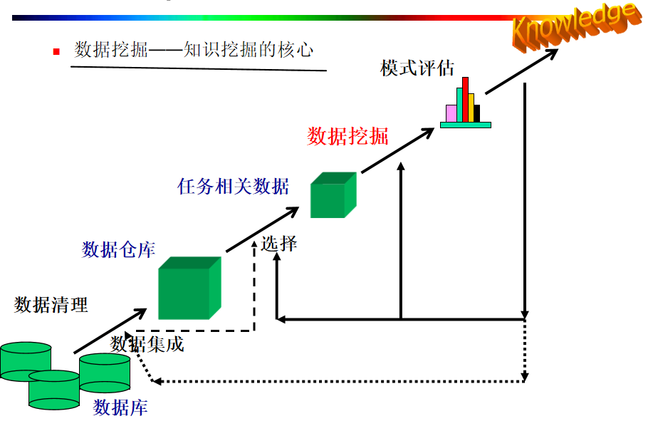
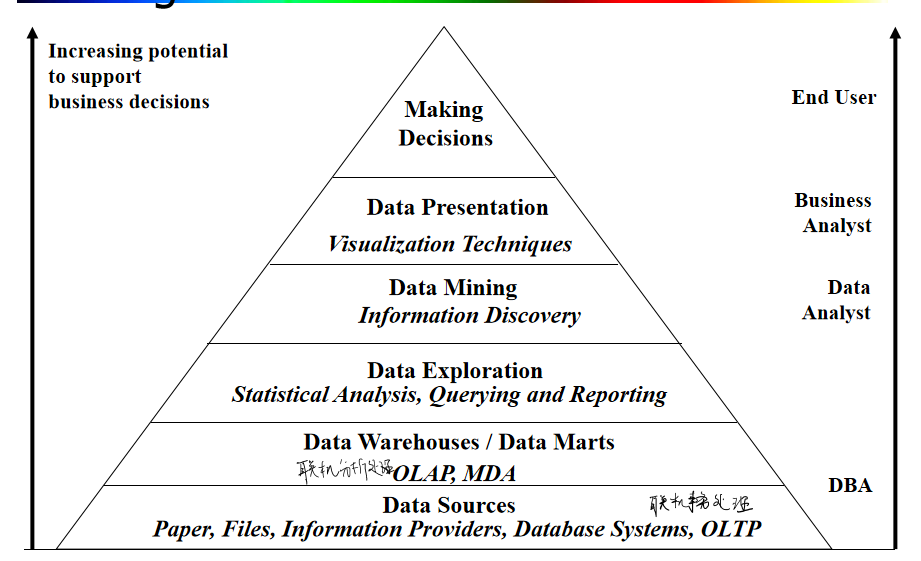
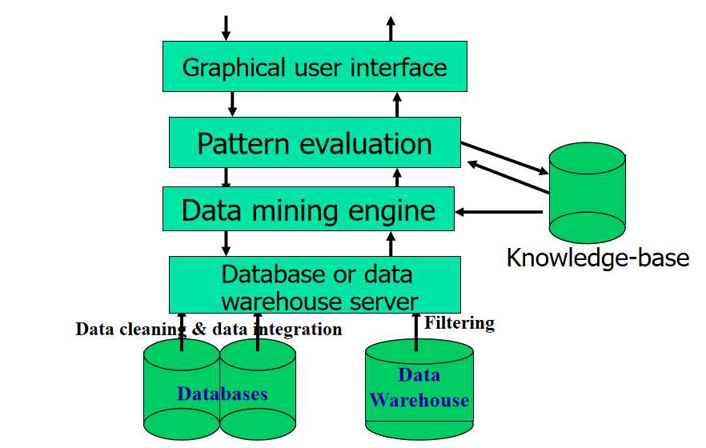
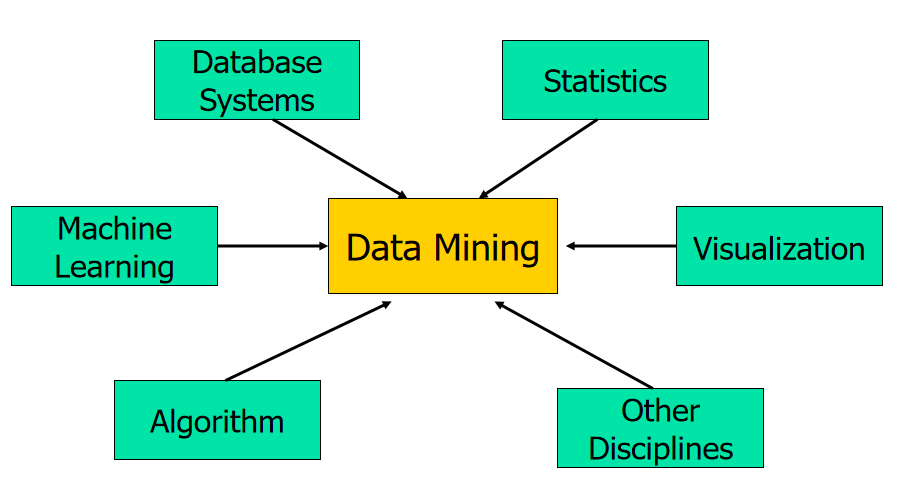
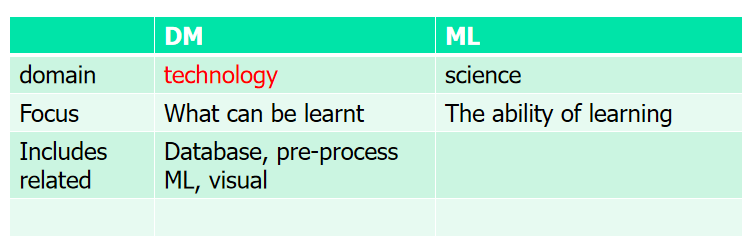

# 第一章 导论
## 1.1 需求
### 建设数字经济面临的问题：   
- 自动数据收集工具和成熟的数据库系统应用导致大量数据积累到数据库中亟待分析
- 数据量大单知识贫乏——仅有0.5%的数据能用来分析    
  
### 解决办法：数据仓库和数据挖掘   
- 数据仓库与联机分析(OLAP)
- 挖掘感兴趣的模式   

## 1.2 数据挖掘的定义及应用
### 定义：
数据挖掘是一个跨学科的计算机科学分支。它是用人工智能、机器学习、统计学和数据库的交叉方法在相对较大型的数据集中发现模式的计算过程。

### 其他名称：
-  KDD （Knowledge discovery in databases)
-  知识提取（knowledge extraction）, data/pattern analysis, data archaeology, data dredging, information harvesting, business intelligence, etc.

### 应用：
- 数据分析和决策支持（Data analysis and decision support)
    - 市场分析和管理（Market analysis and management)
    - 风险分析和管理（Risk analysis and management）
    - 欺诈和非凡模式（孤立点）检测
- 文本挖掘 (news group, email, documents) and Web mining
- 流数据挖掘（Stream data mining）
- DNA 和生物挖掘（DNA and bio-data analysis）
## 1.3 数据挖掘的步骤
### 知识挖掘的核心：数据挖掘

### 知识挖掘步骤：

### 数据挖掘和商业智能：

### 典型数据挖掘系统的步骤和架构：

### KDD（知识挖掘）的步骤：
- 学习应用领域相关知识和应用目标
- 创建目标数据集（选择数据）
- 数据清洗和预处理（可能花费60%的时间）
- 数据压缩和转换(发现有用的特征，进行维度和变量压缩，不变表示法)
- 选择数据挖掘的功能（摘要，分类，回归，关联，聚类）
- 选择数据挖掘算法
- 进行数据挖掘（寻找感兴趣的模式）
- 模式评估和知识表示（可视化，转化，去除冗余的模式）
- 使用挖掘出的知识

## 1.4 数据挖掘的特点
### 分类应用场景
一般功能
- 描述性数据挖掘
- 预测性数据挖掘

不同的特点，不同的分类
- 被挖掘数据的种类
  - 关系型数据
  - 数据仓库
  - 事务型数据库
  - 流数据
  - 面向对象的数据
  - 活跃的数据
  - 空间数据
  - 时间序列数据
  - 文本数据
  - 多媒体数据
- 被发现知识的种类
  - 特征
  - 描述
  - 关联
  - 分类
  - 聚类
  - 趋势
  - 离群值分析
- 使用的技术的种类
  - 面向数据库技术
  - 数据仓库
  - 机器学习
  - 统计学
  - 可视化
- 适用应用的种类
  - 零售业
  - 通讯业
  - 银行
  - 欺诈分析
  - 生物数据挖掘
  - 股市分析
  - web挖掘
- 数据源
  - 关系型数据库
  - 数据仓库
  - 事务型数据库
  - 高级数据库和信息存储库
  - 面向对象数据库
  - 时间和空间数据
  - 时间序列数据
  - 流数据
  - 多媒体数据库
  - 异构和遗产数据库
  - 文本数据库

功能：
- 概念描述：特征化和区分
- 关联：相关性和因果性
- 分类和预测
  - 为了将来的预测创建用来描述概念和区别类别的模型
  - 表示：决策树，分类规则，神经网络
  - 预测一些未知值或者确实值
- 聚类分析
  - 标签未知
  - 离群值分析
    - 离群值是与数据常规表现相异的值
    - 离群值不是噪声也不是异常，它对欺诈识别和罕见事件分析非常有用
- 趋势和演变分析
  - 趋势和偏离
  - 序列模式挖掘
  - 相似性
- 其他模式导向或统计分析

兴趣度度量
- 并不是所有挖掘出的模式都是感兴趣的
- 兴趣度度量的因素（易于理解，对新数据或测试数据有一定置信度，潜在有用，被用户所需求）
- 客观或主观兴趣度度量
  - 客观兴趣度度量：基于统计和模式结构
  - 主观兴趣度度量：基于用户对数据的信任，未预料性，新颖性，可操作性
- 尽可能的发现所有感兴趣的模式
- 只寻找感感兴趣的模式：最优化问题
  - 首先概括所有模式，然后过滤掉不感兴趣的模式
  - 只生成感兴趣的模式-挖掘查询优化

使用的技术

## 1.5 数据挖掘VS其他相关技术
人工智能、模式识别、信息检索、深度学习、统计、数据库都与数据挖掘相关

数据挖掘和机器学习的对比

__领域专家或领域知识对于DM是重要的__
- 验证数据的合理性
- 验证信息的有效性

- 线上分析型数据挖掘集成了数据挖掘和OLAP技术
- 交互式挖掘多层次知识(通过钻取，上卷，切片，切块，旋转对数据进行不同级别的抽象并进行挖掘)
- 集成多种挖掘功能（比如特征化分类，先聚类再关联）

## 1.6 数据挖掘的焦点和挑战
- 挖掘方法
  - 从多类数据中挖掘不同的知识
  - 性能：效率和拓展性
  - 模式评估：问题感兴趣度
  - 背景知识
  - 处理噪声和不完整数据，包括不完整的标签
  - 并行、分布式、增量化的挖掘方法
  - 将当前存在的知识和已发现的知识集成起来：知识融合
- 用户交互
  - 数据挖掘查询语言
  - 结果的可视化和表示
  - 对多层次抽象出（不同粒度）的知识进行集成挖掘
- 应用和社会影响
  - 特点领域数据挖掘和不可见数据挖掘
  - 保护数据安全性，完整性和隐私
  
## 1.7 数据挖掘和伦理
- 数据源是否合法
- 如何使用挖掘结果
  - 贷款审批中区别对待（种族，宗教，性别）
  - 超市销售中货架摆放影响购物时间
- 隐私保护
  - 数据脱敏
  - 匿名信件
  - 人肉

### 1.8 总结
- 数据挖掘：从大量数据中发现感兴趣的模式
- 在巨大需求和广泛应用下的数据库技术的自然进化
- KDD过程包括数据清洗，数据集成，数据选择，数据转换，数据挖掘，模式评估，知识表示
- 数据挖掘可以在各种信息库中进行
- 数据挖掘的功能：特征化，数据区分，关联，分类，聚类，离群点检测和趋势分析
- 数据挖掘系统和架构
- 数据挖掘中的主要问题