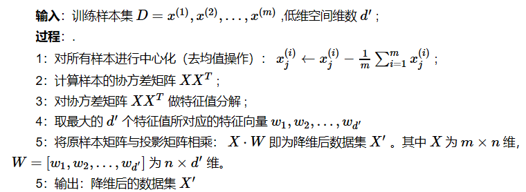
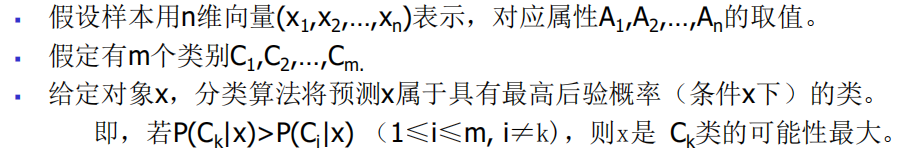
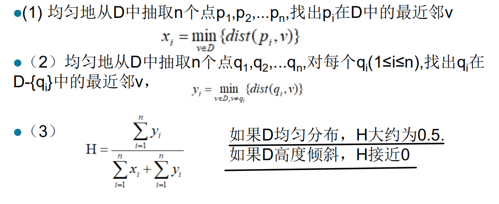

# 第一章 导论
## 1.1 需求
### 建设数字经济面临的问题：   
- 自动数据收集工具和成熟的数据库系统应用导致大量数据积累到数据库中亟待分析
- 数据量大单知识贫乏——仅有0.5%的数据能用来分析    
  
### 解决办法：数据仓库和数据挖掘   
- 数据仓库与联机分析(OLAP)
- 挖掘感兴趣的模式   

## 1.2 数据挖掘的定义及应用
### 定义：
数据挖掘是一个跨学科的计算机科学分支。它是用人工智能、机器学习、统计学和数据库的交叉方法在相对较大型的数据集中发现模式的计算过程。

### 其他名称：
-  KDD （Knowledge discovery in databases)
-  知识提取（knowledge extraction）, data/pattern analysis, data archaeology, data dredging, information harvesting, business intelligence, etc.

### 应用：
- 数据分析和决策支持（Data analysis and decision support)
    - 市场分析和管理（Market analysis and management)
    - 风险分析和管理（Risk analysis and management）
    - 欺诈和非凡模式（孤立点）检测
- 文本挖掘 (news group, email, documents) and Web mining
- 流数据挖掘（Stream data mining）
- DNA 和生物挖掘（DNA and bio-data analysis）
## 1.3 数据挖掘的步骤
### 知识挖掘的核心：数据挖掘

### 知识挖掘步骤：

### 数据挖掘和商业智能：

### 典型数据挖掘系统的步骤和架构：

### KDD（知识挖掘）的步骤：
- 学习应用领域相关知识和应用目标
- 创建目标数据集（选择数据）
- 数据清洗和预处理（可能花费60%的时间）
- 数据压缩和转换(发现有用的特征，进行维度和变量压缩，不变表示法)
- 选择数据挖掘的功能（摘要，分类，回归，关联，聚类）
- 选择数据挖掘算法
- 进行数据挖掘（寻找感兴趣的模式）
- 模式评估和知识表示（可视化，转化，去除冗余的模式）
- 使用挖掘出的知识

## 1.4 数据挖掘的特点
### 分类应用场景
一般功能
- 描述性数据挖掘
- 预测性数据挖掘

不同的特点，不同的分类
- 被挖掘数据的种类
  - 关系型数据
  - 数据仓库
  - 事务型数据库
  - 流数据
  - 面向对象的数据
  - 活跃的数据
  - 空间数据
  - 时间序列数据
  - 文本数据
  - 多媒体数据
- 被发现知识的种类
  - 特征
  - 描述
  - 关联
  - 分类
  - 聚类
  - 趋势
  - 离群值分析
- 使用的技术的种类
  - 面向数据库技术
  - 数据仓库
  - 机器学习
  - 统计学
  - 可视化
- 适用应用的种类
  - 零售业
  - 通讯业
  - 银行
  - 欺诈分析
  - 生物数据挖掘
  - 股市分析
  - web挖掘
- 数据源
  - 关系型数据库
  - 数据仓库
  - 事务型数据库
  - 高级数据库和信息存储库
  - 面向对象数据库
  - 时间和空间数据
  - 时间序列数据
  - 流数据
  - 多媒体数据库
  - 异构和遗产数据库
  - 文本数据库

功能：
- 概念描述：特征化和区分
- 关联：相关性和因果性
- 分类和预测
  - 为了将来的预测创建用来描述概念和区别类别的模型
  - 表示：决策树，分类规则，神经网络
  - 预测一些未知值或者确实值
- 聚类分析
  - 标签未知
  - 离群值分析
    - 离群值是与数据常规表现相异的值
    - 有时候离群值不是噪声也不是异常，它对欺诈识别和罕见事件分析非常有用
- 趋势和演变分析
  - 趋势和偏离
  - 序列模式挖掘
  - 相似性
- 其他模式导向或统计分析

兴趣度度量
- 并不是所有挖掘出的模式都是感兴趣的
- 兴趣度度量的因素（易于理解，对新数据或测试数据有一定置信度，潜在有用，被用户所需求）
- 客观或主观兴趣度度量
  - 客观兴趣度度量：基于统计和模式结构
  - 主观兴趣度度量：基于用户对数据的信任，未预料性，新颖性，可操作性
- 尽可能的发现所有感兴趣的模式
- 只寻找感感兴趣的模式：最优化问题
  - 首先概括所有模式，然后过滤掉不感兴趣的模式
  - 只生成感兴趣的模式-挖掘查询优化

使用的技术

## 1.5 数据挖掘VS其他相关技术
人工智能、模式识别、信息检索、深度学习、统计、数据库都与数据挖掘相关

数据挖掘和机器学习的对比

__领域专家或领域知识对于DM是重要的__
- 验证数据的合理性
- 验证信息的有效性

- 线上分析型数据挖掘集成了数据挖掘和OLAP技术
- 交互式挖掘多层次知识(通过钻取，上卷，切片，切块，旋转对数据进行不同级别的抽象并进行挖掘)
- 集成多种挖掘功能（比如特征化分类，先聚类再关联）

## 1.6 数据挖掘的焦点和挑战
- 挖掘方法
  - 从多类数据中挖掘不同的知识
  - 性能：效率和拓展性
  - 模式评估：问题感兴趣度
  - 背景知识
  - 处理噪声和不完整数据，包括不完整的标签
  - 并行、分布式、增量化的挖掘方法
  - 将当前存在的知识和已发现的知识集成起来：知识融合
- 用户交互
  - 数据挖掘查询语言
  - 结果的可视化和表示
  - 对多层次抽象出（不同粒度）的知识进行集成挖掘
- 应用和社会影响
  - 特点领域数据挖掘和不可见数据挖掘
  - 保护数据安全性，完整性和隐私
  
## 1.7 数据挖掘和伦理
- 数据源是否合法
- 如何使用挖掘结果
  - 贷款审批中区别对待（种族，宗教，性别）
  - 超市销售中货架摆放影响购物时间
- 隐私保护
  - 数据脱敏
  - 匿名信件
  - 人肉

## 1.8 总结
- 数据挖掘：从大量数据中发现感兴趣的模式
- 在巨大需求和广泛应用下的数据库技术的自然进化
- KDD过程包括数据清洗，数据集成，数据选择，数据转换，数据挖掘，模式评估，知识表示
- 数据挖掘可以在各种信息库中进行
- 数据挖掘的功能：特征化，数据区分，关联，分类，聚类，离群点检测和趋势分析
- 数据挖掘系统和架构
- 数据挖掘中的主要问题

# 第二章 数据仓库

## 2.1 数据及数据类型
__吕俊伟这节ppt是空的 望周知__

## 2.2 数据库与数据仓库
### 数据仓库与数据库的简单对比
__数据库为操作而生，数据仓库为分析而生__

事务操作数据库：
- 设计原则：
  - 范式（规范并减少冗余）
  - 三少（表个数，组合主键的字段个数，表中的字段个数）
- 目的：
  - 快速的操作
  - 较少的冗余
- 在数据冗余和处理速度之间找到合适的平衡点

面向数据分析时，数据仓库在数据库的基础上，更注重：
- 从存储的设计上考虑数据分析的需求，不再简单的追求范式约束
- 异构环境的转换和共享：数据分析不可避免的需要大量的历史数据，异构数据，__如何设计和实现数据的转换和共享是数据仓库的一个重要问题__
- 为分析和决策提供支持：需要对大量历史数据能方便的进行宏观的或微观的汇总和表示，实现数据不同粒度、角度的表示

### 数据仓库的定义
- W.H.Inmon的定义：“数据仓库是支持管理决策过程的、面向主题的、集成的、随时间而变的、持久的数据集合”
- 另外一个定义：“数据仓库（Data Warehouse）是一个面向主题的（Subject Oriented）、集成的（Integrated）、相对稳定的（Non-Volatile）、反映历史变化（Time Variant）的数据集合，用于支持管理决策。”

### 数据仓库的特点
1.面向主题
  - 面向主题是数据仓库显著区别于关系数据库系统的一个特征（操作型数据库面向事务处理transaction）
  - Subject（主题）是指用户使用数据仓库进行决策时所关心的重点方面，一个主题通常与多个操作型信息系统相关。
    - 围绕一些主题，如顾客、供应商、产品等
    - __关注决策者的数据建模与分析，而不是集中于日常操作和事务处理__。
    - 排除对于决策无用的数据，提供特定主题的简明视图。
    - 操作性环境和分析性环境
2.集成：一个数据仓库是通过集成多个异种数据源来构造的。
  - 比如关系数据库，一般文件，联机事务处理记录
  - 数据仓库的数据有来自于分散的操作型数据，将所需数据从原来的数据中抽取出数据仓库的核心进行加工与集成，统一综合后进入数据仓库; 
  - 这个过程中需要使用**数据清理和数据集成**技术
    - 确保命名约定、编码结构、属性度量等的一致性
    - 当数据被移到数据仓库时，它们要经过转化，如字段名统一，单位统一等。
    - 还有一定的汇总，统计等功能
3.随时间变化
  - 从存储角度，数据仓库的数据变化多是一次性大量存储或移除，**DW数据内容不可修改（修改应保留修改痕迹）**。
  - 从分析角度，DW的数据以只读格式保存，其随时间变化相对稳定。
  - 数据仓库是从历史的角度提供信息
    - 数据仓库的时间范围比操作数据库系统要长的多
      - 操作数据库系统: 主要保存当前数据。
      - 数据仓库:从历史的角度提供信息（比如过去 5-10 年）
    - 数据仓库中的每一个关键结构都隐式或显式地包含时间元素，而操作数据库中的关键结构可能就不包括时间元素。
4.数据不可更新、不易丢失
  - 尽管数据仓库中的数据来自于操作数据库，但他们却是在物理上分离保存的。
    - 操作数据库的更新操作不会出现在数据仓库环境下
    - 不需要事务处理，恢复，和并发控制等机制
    - 数据的初始转载和数据访问（读操作）
    - __数据仓库中的数据也需要定期进行清理__
5.汇总的
  - 操作性数据映射成决策可用的格式。 
6.大容量
  - 时间序列数据集合通常都非常大。 
7.非规范化的
  - Dw数据可以是而且经常是冗余的。 
8.元数据
  - 将描述数据的数据保存起来
9.数据源
  - 据来自内部的和外部的非集成操作系统。

__数据集市(DataMarts) ：__   
为了特定的应用目的或应用范围，而从数据仓库中独立出来的一部分数据，也可称为部门数据或主题数据(subject area)。

### DW中数据汇总的示例

### DW上的OLAP操作
- 维
  - 是观察数据的特定角度，是考虑问题时的一类属性（时间维、地点维））
- 维的层次
  - 数据某个特定维度还存在细节程度不同的各个描述
- 维的成员
  - 维的一个取值
- 多维数组
  - 维和变量的组合表示
- 数据立方体是一种对多维的数据模型的描述方式
- 基本的OLAP操作

数据仓库的三种应用
  - 信息处理
    - 支持查询和基本的统计分析，并使用交叉表、表、图标和图进行报表处理
  - 分析处理
    - 对数据仓库中的数据进行多维数据分析
    - 支持基本的OLAP操作，切块、切片、上卷、下钻、转轴等，多粒度的知识表示
  - 构建规范
    - 数据的类型
      - 数据库(mysql):在线交易数据
      - 数据仓库(hive):历史数据
    - 建模
      - 数据库(mysql):数据库的建模遵循三范式。
      - 数据仓库(hive):采用维键建模。
    - 存储
      - 数据库(mysql):存储在线交易数据。
      - 数据仓库(hive):存多种数据,数据量大,历史数据。
    - 设计
      - 数据库：尽量避免冗余符合范式规则。
      - 数据仓库：引入冗余，反范式方式设计，分析数据
    - 目的
      - 数据库：为捕获数据而设计。
      - 数据仓库：为分析数据而设计。

## 2.3 数据仓库的概念模型
### 一些概念：
- DW中数据存在多个维：如客户，地点，产品等
- 不同维之间的交叉点称为事实
- 概念模型用来构建这种数据维与事实间的关系
- 最流行的数据仓库概念模型是多维数据模型。这种模型可以以星型模式、雪花模式、事实或星座模式的形式存在。

### 各种模型
- 星座模型
  - 一种非正规化的结构，每个维度都直接与事实表连接，不存在渐变维度
  - 特点：有一定的冗余，查询效率高，维护方便
  
- 雪花模型
  - 是星型模式的变种，其中某些维表是规范化的，因而把数据进一步分解到附加表中。结果，模式图形成类似于雪花的形状。**有一个或多个维表没有直接连接到事实表上，而是通过其他维表连接到事实表上**
  - 冗余小，查询效率低，维护困难
  
  
- 事实星座模型：
  - 复杂应用可能需要多个事实表共享维表, 这种模式可以看作星型模式的汇集，因此称为星系模式（galaxy schema），或者事实星座（fact constellation） 
  - 由多个主题构成，包含多个事实表，而维表是共享，避免冗余
  - 适用于主题较多情况
  
- 设计原则
  - 数据仓库的设计遵循自顶向下的方式来构建
  - 维表之间交叉减少
  - 级联的层次减少

## 2.4 数据仓库的体系结构
### 三层数据仓库架构

- 底层：数据仓库的数据库服务器
  - 关注的问题：如何从这一层提取数据来构建数据仓库（通过Gateway（ODBC,JDBC,OLE/DB等）来提取）
- 中间层：OLAP服务器
  - 关注的问题：OLAP服务器如何实施（关系型OLAP，多维OLAP等）
- 前端客户工具层
  - 关注的问题：查询工具、报表工具、分析工具、挖掘工具等

### 数据仓库开发的困难和解决方法
- 困难
  - 自顶向下的开发方法从全系统的角度提供解决方案，使得（模块）集成的问题最小；但是该方法十分昂贵，需要对组织进行长期研究和建模分析。
  - 自底向上方法提供了更多的开发灵活性，价格便宜；但往往会遇到集成问题（每个模块单独运行都没有问题，但是一集成就出异常）
- 解决方法
  - 使用有序、反复、一次一步的递增式、演化性的开发方法
  - 高层数据模型->企业仓库和数据集市并行开发->通过分布式模型集成各数据集市->多层数据仓库

## 2.5 数据仓库到数据挖掘
__不得不吐槽吕俊伟ppt的混乱__

# 第三章 数据预处理与表示
__（数据驱动式）数据分析的基本步骤__

## 3.1 数据预处理的定义
### 3.1.1 一些定义
- __数据预处理是指在数据分析任务以前对数据进行的一些处理，以减小数据某些方面对算法性能的影响__
  - 榨果汁-----切块
  - 分类----去噪音、缺失值填充、归一化等
- 特征选择是从原始特征数据集中选择出子集，是一种包含的关系，**没有更改原始的特征空间**。
- 特征提取是通过属性间的关系，如组合不同的属性得到新的属性，这样就**改变了原来的特征空间**。
- 特征表示是学习更高层的、**具有语义等任务相关信息**的表示

### 3.1.2 数据预处理的重要性
- 没有高质量的数据，就没有高质量的挖掘结果
  - 高质量的决策必须依赖高质量的数据
    - 重复值或者空缺值将会产生不正确的或者令人误导的统计
  - 数据仓库需要对高质量的数据进行一致地集成
  - 低质量的数据 VS 算法性能
  - 低质数据挖掘是当前一个热门的研究方向
- 数据预处理将是构建数据仓库或者进行数据挖掘的工作中**占工作量最大**的一个步骤

### 3.1.3 数据质量问题表现形式
- 误差：测量误差和收集误差或错误     难以处理
- 数据不一致
  - 例如：在编码或者命名上存在差异
  - 例如：过去的等级： “1,2,3”,  现在的等级： “A, B, C”
  - 例如：Age=“42” Birthday=“03/07/1997”
-  噪声
  - 包含错误或者孤立点或离群点（outlier）
  - 明显噪声和非明显噪声
- 重复数据 duplication
  - 区分重复合法与否
- 数据不完整
  - 缺少数据值
  - 缺乏某些重要属性
  - 仅包含汇总数据
- 时效性
- 相关性
- 采样合理性

## 3.2 描述性数据汇总
### 3.2.1 动机：为了更好的理解数据
  - 获得数据的总体印像
  - 识别数据的典型特征
  - 凸显噪声或离群点
  - 检查不一致数据，异常数据

### 3.2.2 度量数据的中心趋势
  - 可以用均值、中位数、众数（模）、中列数等度量
  - 算术平均值
  
  - 加权算术平均
  
  - 截断均值（trimmed mean）：去掉高、低极端值得到的均值
    - 例如计算平均工资时，可以截掉上下各2％的值后计算均值，以抵消少数极端值的影响
  - 中位数：有序集的中间值或者中间两个值平均
    - 整体度量；但是可以通过插值法计算近似值
    
    
  - 众数（Mode，也叫模）：集合中出现频率最高的值
    - 单峰的（unimodal，也叫单模态）、双峰的（bimodal）、三峰的（trimodal）；多峰的（multimodal）
    - 对于适度倾斜（非对称的）的单峰频率曲线，可以使用以下经验公式计算众数
    
    - 对称与正倾斜、负倾斜数据的中位数、均值和众数
    

### 3.2.3 度量数据的离散程度
  - 四分位数、四分位数极差、方差等
  - 最常用度量：极差、五数概括（基于四分位数）、中间四分位数极差和标准差
    - 极差（range）：数据集的最大值和最小值之差
    - 百分位数(percentile)：第k个百分位数是具有如下性质的值x：k%的数据项位于或低于x
      - 中位数就是第50个百分位数
    - 四分位数：Q1 (25th percentile), Q3 (75th percentile)
    - 中间四分位数极差(IQR)： IQR = Q3 – Q1 
    - 孤立点：通常我们认为：挑出落在至少高于第三个四分位数或低于第一个四分位数 1.5×IQR处的值
    - 五数概括: min, Q1, Median, Q3, max
    - 盒图：数据分布的一种直观表示
    - 方差和标准差
      - 方差s2：n个观测之x1,x2...xn的方差是
      
      - 标准差s是方差s2的平方根
        - 标准差s是关于平均值的离散的度量，因此**仅当选平均值做中心度量时使用**
        - 所有观测值相同则 s＝0，否则 s>0
        - 方差和标准差都是代数度量

### 3.2.4 度量分类
  - 分布式度量(distributive measure)：将函数用于n个聚集值得到的结果和将函数用于所有数据得到的结果一样
    - 比如：count()，sum()，min()，max()等
  - 代数度量(algebraic)：可以通过在一个或多个分布式度量上应用一个代数函数而得到
    - 比如：平均值函数avg()  avg() =sum()/count()
  - 整体度量(holistic)：必须对整个数据集计算的度量
    - 比如：median()，mode()，rank()

### 3.2.5 基本统计类描述的图形显示
  - 常用的显示数据汇总和分布的方法：
    - 直方图、分位数图、q-q图、散布图和局部回归曲线
  - 直方图: 一种单变量图形表示方法
    - 将数据分布划分成不相交的子集或桶，通常每个桶宽度一致并用一个矩形表示，其高度表示桶中数据在给定数据中出现的计数或频率
  
  
  - 散布图
    - 确定两个量化的变量之间看上去是否有联系、模式或者趋势的最有效的图形方法之一
    - 散布图中的每个值都被视作代数坐标对，作为一个点画在平面上
    - 易于观察双变量数据在平面上的分布
  
  - loess曲线
    - loess曲线为散布图添加一条平滑的曲线，以便更好的观察两个变量间的依赖模式
    - Loess (local regression)意指“局部回归”，为了拟合loess曲线，需要两个参数：平滑参数α ，被回归拟合的多项式的阶λ 
  
  

### 3.2.6 定量数据分布分析例题
下表是描述菜品捞起生鱼片在2014年第二个季度的销售数据，绘制销售量的频率分布表、频率分布图，对该定量数据做出相应的分析。

- 第一步：求极差：
极差 = 最大值 - 最小值 = 3960-45=3915
- 第二步：分组：
这里根据业务数据的含义，可取组距为500。
组数 = 极差/组距 = 3915/500=7.83=8
- 第三步：决定分点，如下表：

- 第四步：绘制频率分布表

- 第五步：绘制频率分布直方图
若以2014年第二季度捞起生鱼片每天的销售额为横轴，以各组段的频率密度（频率与组距之比）为纵轴，表3‑3的数据可绘制成频率分布直方图，见图：

### 3.2.7 Pyhthon统计数据

## 3.3 结构化数据
### 3.3.1 数据预处理（缺失值，噪音，重复数据，数据变换，离散化，采样Sampling， 维归约及选择）

  - 数据清理
    - 填写空缺的值，平滑噪声数据，识别、删除孤立点，解决不一致性
    - 空缺值处理
      - 引起空缺值的原因
        - 设备异常
        - 与其他已有数据不一致而被删除
        - 因为误解而没有被输入的数据
        - 在输入时，有些数据因为得不到重视而没有被输入
        - 对数据的改变没有进行日志记载
      - 空缺值处理方法
        - 忽略元组
          - 当类标号缺少时通常这么做（假定挖掘任务设计分类或描述），当每个属性缺少值的百分比变化很大时，它的效果非常差。
        - 人工填写空缺值：工作量大，可行性低
        - 填充：基于对已知的取值的观察和分析，对缺失值进行自动填充
          - 用一个全局变量填充空缺值：比如使用unknown或∞
          - 使用属性的（加权/截断）平均值/众数/中位数填充空缺值
          - 基于Bayesian，knn或判定树推断的方法
          - 插值方法：Hermite插值、分段插值、样条插值法，而最主要的有拉格朗日插值法和牛顿插值法。
            - 拉格朗日插值法
            
              - 据若干个不同的地方得到相应的观测值，拉格朗日插值法可以拟合一个多项式（拉格朗日（插值）多项式）。
              - 数学上来说，拉格朗日插值法可以给出一个恰好穿过二维平面上若干个已知点的多项式函数。
              - 该方法的使用条件：
                - 假设x，y符合多项式分布
                - 需找到一个合理的x
      - 众数或均值等填充方法有以下特点：
        - 仅针对缺失值的这一列数据进行分析
        - 分析的技术主要是简单的统计和数值分布因此，其不能完成**??**条件下的缺失值填充
    - 噪声数据
      - 噪声：一个测量变量中的随机错误或偏差
      - 引起不正确属性值的原因
        - 数据收集工具的问题
        - 数据输入错误
        - 数据传输错误
        - 技术限制
        - 命名规则的不一致
      - 其它需要数据清理的数据问题
        - 重复记录
        - 不完整的数据
        - 不一致的数据
      - 处理方法
        - 分箱(binning)
          - 首先排序数据，并将他们分到等深的箱中
          - 然后可以按箱的平均值平滑、按箱中值平滑、按箱的边界平滑等等
        
        - 回归
          - 通过让数据适应回归函数来平滑数据
        - 聚类
          - 通过聚类分析检测离群点，消除噪声
          - 聚类将类似的值聚成簇。直观的，落在簇集合之外的值被视为离群点
         
        - 计算机和人工检查结合
          - 计算机检测可疑数据，然后对它们进行人工判断
    - Python实现数据清理
      - 缺失值处理
      
      - 噪声处理
      
      - 重复值处理
        - 去掉重复数据train.drop_duplicates()
  - 数据集成
    - 集成多个数据库、数据立方体或文件
  - 数据变换
    - 规范化和聚集
    - 规范化
      - 必要性：数值差异过大会导致计算值的偏差
      - 改变了数据的值
      - 规范化方法
        - 简单的规范化：Log (x)，sin(x)，x/sum(x)
        - 最小－最大规范化    
        
        - z-score规范化(最大最小值未知，或者离群点影响较大的时候适用)
        
        - 小数定标规范化    
        
        
  - 数据归约
    - 得到数据集的压缩表示，它小得多，但可以得到相同或相近的结果
    - 数据归约是指在对挖掘任务和数据本身内容理解的基础上、寻找依赖于发现目标的数据的有用特征，以缩减数据规模，从而在尽可能保持数据原貌的前提下，最大限度地精简数据量。
  - 数据离散化
    - 数据归约的一部分，通过概念分层和数据的离散化来规约数据，对数字型数据特别重要

### 3.3.2 数据表示（特征选择、提取和表示）
- 特征的处理分为三大类：**选择、提取和表示**。其目的是**降维**和**提升对任务的表达能力**
- 通过特征选择和特征提取可以实现属性降维
- 属性构造：通过现有属性构造新的属性，并添加到属性集中，以增加对高维数据的结构的理解和精确度。   

- 维度增加不仅仅是数据体量上的增加，往往伴随着稀疏性的增加

#### 特征选择
- 特征选择通过删除不相干的属性或维减少数据维度，一般是**基于原始特征空间**
  - 删除冗余特征和不相关特征
- 特征选择的方案
  - filter（过滤法）
    - 根据统计指标值(如方差、优势比、信息增益)对所有特征进行排序，取得前k个值；或者设置选择阈值h
    - 目的：在维持算法表现的前提下，帮助算法们降低计算成本
    - 特点：独立操作，计算简单，不与后续分类（或者回归）模型相关。但忽略了特征空间子集在解决分类问题中的作用
    - 过程：全部特征->最佳特征子集->算法->模型评估
    - 过滤特征选择的指标
      - 相似性和相异性
        - 欧几里得距离
        - cos距离    
        
        
        - 简单匹配系数    
        
        - Jaccard系数    
        
        - 广义Jaccard（Tanimoto）    
        
      - 相关性
        - 皮尔森系数Pearson’s correlation    
        
        - 协方差    
        
        - 标准差    
        
        - 正相关 corr=1      x=(1,-2)  y=(2,-4)
        - 负相关 corr=-1     x=(1,-2)  y=(-2,4)
        - 非线性相关 corr=0   x=(1,-2)  y=(-2,-4)
        - 例：
  - wrapper（包装法）
    - 选择一个基分类器，启发式搜索所有可能的特征子空间，评估分类效果，选择/过滤具有代表性的特征组合空间
    - 特点：结合后续分类（或者回归）模型，根据评估结果进行选择。每次遍历剩余所有未选择的特征。由于要计算每个特征的分类性能，计算量较大。所使用的评估算法未知，可能对评估算法敏感。**子集产生不依赖算法**。
    - 过程：特征选择和算法训练同时进行的方法，依赖于算法自身的选择，比如coef_属性或feature_importances_属性来完成特征选择。对于每一个待选的特征子集，都在训练集上训练一遍模型，然后在测试集上根据误差大小选择出特征子集。前提是要选好后续要用的分类（或者回归）算法，如Random Forest，SVM，kNN等等。
  - embedded（嵌入法）    
    
    - 类似于Filter，算法决定产生子集。先使用算法和模型进行训练，得到各个特征的权值系数，根据权值系数从大到小选择特征。
    - 特点：结合后续分类（或者回归）模型，根据评估结果进行选择。 每次遍历所有的特征（包括选择和未选择的）。所使用的评估算法未知，可能对评估算法敏感。**子集产生依赖算法**。
    - 过程：类似于Filter，只不过系数是通过训练得来的。嵌入法是一种让算法自己决定使用哪些特征的方法，即**特征选择和算法训练同时进行**。在使用嵌入法时，我们先使用某些机器学习的算法和模型进行训练，得到各个特征的权值系数，根据权值系数从大到小选择特征。设置的阈值threshold决定最后选择出的特征的个数，阈值threshold是个超参数，选取比较不易控。
- 特殊的特征选择——特征加权
  - 找出最小属性集，使得数据类的概率分布尽可能的接近使用所有属性的原分布
  - 减少出现在发现模式上的属性的数目，使得模式更易于理解
- 特征选择概述
  - 特征选择示意图    
    
  - 特征选择的停止条件
    - 达到设定需要选择的维数，也即达到特征个数方面的某种阈值
    - 事先设定的计算迭代次数
    - 特征子集已经收敛，**即使继续扩大特征自己的规模都不会产生更好的子集**
    - 根据某种评估标准已经获得最优的子集
  - 按照最优特征集合的产生过程
    - 穷举法：是遍历所有特征子集选取最优集的方法，虽然这样做一定可以找到最优解
      - 例如回溯法
    - 启发式方法：利用某种主观的启发式规则进行搜索的过程，从而避免搜索全部子集产生的庞大时空开销；
      - 例如：著名的C4.5决策树方法就是采用信息增益作为启发式规则来获取近似最优解；
    - 随机式方法：完全随机法和概率随机法
      - 例如：遗传算法就是通过将某个子集放在具体环境里不断交叉、复制等产生更适应环境的解；

#### 特征提取
- 特征提取，也叫属性抽取——将高维特征空间映射到低维空间
  - 高维空间中的特征是原特征空间中没有的新的特征
  - 这些新特征大多为组合变换后的特征
- 典型方法
  - PCA(主成分分析)    
    
    - 一种用于连续属性的线性代数技术，它找出新的属性（主成分），这些属性是原属性的线性组合，是相互正交的，并且捕获数据的最大变差，最小协方差（协方差为0，相互独立）。**PCA是一种主要的特征降维技术。**
    - 功能：对指标变量矩阵进行主成分分析
    - PCA降维准则
      - 最近重构性：重构后的点距离原来的点的误差之和最小。
      - 最大可分性：样本在低维空间的投影尽可能分开
      - 不相关：将可能存在相关性的变量数据转换为一组线性不相关的变量
    - PCA本质上是将方差最大的方向作为主要特征，并且在各个正交方向上将数据“零相关”，也就是让它们在不同正交方向上没有相关性。
    - 过程    
    
      - 1.去中心化   
       
        - 去中心化的好处
          - 方便协方差求解
          - 特征值分解
      - 2.计算协方差矩阵      
      
      - 3.特征值分解    
      
      - 4.降维后的数据    
      
    - 优点
      - 使得数据集更易使用；降低算法的计算开销；
      - 去除噪声；    使得结果容易理解
      - 完全无参数限制、无监督
    - 缺点
      - 难以利用先验知识来干预方法，可能会得不到预期的效果，效率也不高；
      - 特征值分解有一些局限性，如变换的矩阵必须是方阵
      - 在非高斯分布情况下，PCA方法得出的主元可能不是最优
  - SVD(奇异值分解) 

# 第四章 分类与预测
分类与预测的案例
- 市民出行选乘公交预测
- 商品图片分类
- 监控场景下的行人精细化识别

## 4.1 分类与预测的概念
### 分类的两个步骤
- 模型的建立：
  - 给定一个事先确定类别属性的数据集合
  - 每一个实体假设属于一个事先定义好的类别，也就是说它们的类别属性的值是确定的
  - 用来构造模型的实体集合我们把它叫做**训练集合**
  - 模型以分类规则, 决策树,或者是数学函数的形式给出
- 模型的使用:用来对未来或者是未知的数据进行分类
  - 模型精度的评估
    - 用分类结果与测试集合实际的类别属性值进行比较
    - 分类精度的值为测试集合中被分类模型正确分类的实体在测试集合中所占的比率
    - 测试集合与分类集合相互独立, 否则将会发生过拟合
  - 如果精度的值是可以接受的, 那么将使用此分类模型对那些决策属性未知的实体进行分类

### 监督学习与非监督学习
- 监督学习 (分类)
  - 训练数据集合 (观察，测量等方法得到) 的类别属性是由观察得到的，是已知的
  - 新的数据集合由基于训练集合得到的分类模型进行分类
- 非监督学习 (聚类)
  - 训练集合的类别属性是未知的
  - 给出一个由观察或测量等方法得到的数据集合。在数据中建立已经存在的类或簇

## 4.2 与分类和预测相关的几个问题
1. 数据预处理
- 数据清理
  - 数据清理的目的是减少噪音和处理缺失数据
- 数据分析 (特征选择)
  - 删除无关的、冗余的属性，选择相关属性
- 数据变换
  - 泛化
  - 规范化数据
2. 分类方法的评估
- 预测精度
|         |         |
|---------|---------|
| TP      | TN      |
| FP      | FN      |
  - 实际中正例的个数为TP+FN
  - 正确率(accuracy)=（TP+TN）/(P+N)
  - 错误率(error rate) = (FP+FN)/(P+N)
  - 灵敏度(sensitive) = TP/P
    - 表示的是所有正例中被分对的比例，衡量了分类器对正例的识别能力
  - 特效度(specificity) = TN/N
    - 表示的是所有负例中被分对的比例，衡量了分类器对负例的识别能力
  - 精度(precision) = TP/(TP+FP)
    - 精度是精确性的度量，表示被分为正例的样本中实际为正例的比例
  - 召回率(recall) = TP/(TP+FN)=TP/P=sensitive 与灵敏度一样
  - ROC(Receiver operating Characteristic Curve)
  
    - 横坐标表示假阳性率FPR，纵坐标表示正阳性率TPR
    - TPR=TP/(TP+FN)
    - FPR=FP/(FP+TN)
    - ROC同时关注正负样本,**在imbalance数据集上更敏感**。
    - ROC曲线越靠拢(0,1)点，越偏离45度对角线越好
    - **网络访问中的入侵检测评估，采用ROC指标比较合适**
  - 选择什么指标取决于具体应用，比如在癌症疾病诊断中正例检测为负例带来的代价和负例检测为正例带来的代价是不同的
- 时间性能
  - 建立模型所花费时间
  - 使用模型所花费时间
- 健壮性
  - 处理噪音和缺失数据的能力
- 空间性能
  - 处理驻磁盘数据库的能力等
- 可理解性
  - 模型给出的结果的可理解性
- 规则的评估
  - 模型规模大小
  - 分类规则的简洁性

### 主要分类与预测算法

| 算法名称      | 算法描述         |
|:---------|------------------|
| 回归分析      | 回归分析是确定预测属性（数值型）与其他变量间相互依赖的定量。关系的最常用的统计学方法。包括线性回归、非线性回归、Logistic回归、岭回归、主成分回归、偏最小二乘回归等模型。      |
| 决策树        | 它采用自顶向下的递归方式，在决策树的内部结点进行属性值的比较，并根据不同的属性值从该结点向下分支，叶结点是要学习划分的类      |
| 人工神经网络   | 一种模仿大脑神经网络结构和功能而建立的信息处理系统，表示神经网络的输入与输出变量之间关系的模型。       |
| 贝叶斯网络     | 贝叶斯网络又称信度网络，是Bayes方法的扩展，是目前不确定知识表达和推理领域最有效的理论模型之一。      |
| 支持向量机     | SVM支持向量机根据有限的样本信息在模型的复杂性和学习能力之间寻求最佳折衷，以获得最好的推广能力。      |

## 4.3 决策树分类
### 4.3.1 决策树构造算法CLS
- 决策树（Decision Tree）是一种最常用的分类知识描述模型
- 决策树是一棵树结构
  - 每个分支结点对应一个对象集合和一个属性选择
  - 每个分支对应一个测试条件
  - 叶子结点对应一个类别判断
- 该算法接受一组训练实例，构造出决策树
- 决策树从根结点到叶子结点可得到有关概念的一个描述，将类型相同的各个叶子结点所对应的描述合在一起可构成该概念的所有描述
- 构造过程采用的是**自上而下的，递归的，分而治之**的方法。
- CLS算法主要步骤
  - T:=所有训练实例集合，产生一个结点T
  - 如果T中所有实例都是正例，则为该结点产生一个“yes”标志，并结束
  - 如果T中所有实例都是反例，则产生一个“no”标志，并结束
  - 否则，选择一个属性X
    - 假设其所有取值为v1,v2,… ,vn
    - 则依据这些取值，将T划分为n个子集T1,T2,… ,Tn
    - 建T的n个孩子结点Ti，并分别以X= vi作为从T到Ti的分支标号
  - 对每个Ti，以递归的方式建一棵以Ti为根的子树
- CLS构造决策树示例
  - 对下面数据表，构造出关于属性buys_computer的分类规则   
  
  - 选择属性的顺序不同，将构造出不同的决策树   
  
  
- CLS算法特点
  - 简捷、直观
  - 抗干扰能力弱，算法对噪音敏感
  - 易受无关属性的影响，导致规则烦琐
  - 受属性选择次序的影响
    - 各条件属性对分类的影响程度可能存在差异
    - 选择次序得当，将使规则能反映其关系的实质。但如果将影响因素小的在前面展开，将导致规则条件烦琐，不能反映其内在联系
  - 只能发现部分规则

### 4.3.2 决策树构造算法ID3算法
- 算法主要步骤
  - T:=所有训练实例集合，产生一个结点T
  - 如果T中所有实例都属于一个类别，则为该结点产生一个类别标记，并结束
  - 否则，选择**具有最高信息增益**的属性X
    - 假设其所有取值为v1,v2,… ,vn
    - 则依据这些取值将T划分为n个子集T1,T2,… ,Tn
    - 建T的n个孩子结点Ti，并分别以X=vi作为从T到Ti的分支标号
    - 对每个Ti，以递归的方式建一棵以Ti为根的子树
- 信息增益
  - 用信息熵度量样例的纯度   
     
  S：样例的集合  p+：样例集中正例的比例  p-：样例集中反例的比例   
      
  熵用于衡量类分布的倾斜度/不同节点中的不纯度,越纯则类分布就越倾斜   
  Entropy([9+, 5-]) < Entropy([7+, 7-])
  - 信息增益最大属性的选择   
    
     

### 4.3.3 决策树模型的评估
- 构造的决策树需要用新的数据（测试数据）来检验
  - 针对正确分类率、误分类率、时间性能等指标，以此作为衡量求解结果的指标，以及作为修正的依据
- 训练集合与测试集合的划分 ----典型的划分有 2:1  5:1  9:1
- K-交叉验证
  - 一般情况将K交叉验证用于模型调优，找到使得模型泛化性能最优的超参值
  - K-交叉验证是指将原始数据分成K组(一般是均分)，将每个子集数据分别做一次验证集，其余的K-1组子集数据作为训练集，这样会得到K个模型，用这K个模型最终的验证集的分类准确率的平均数作为此K-CV下分类器的性能指标。K一般大于等于2，实际操作时一般从3开始取，只有在原始数据集合数据量小的时候才会尝试取2.。而K-CV 的实验共需要建立 k 个models，并计算 k 次 test sets 的平均辨识率。在实作上，k 要够大才能使各回合中的 训练样本数够多，一般而言 k=10 (作为一个经验参数)算是相当足够了。
- 理想的模型误差：具有低训练误差和低泛化误差
- 欠拟合：训练误差高，泛化误差高
- 过拟合：训练误差低，泛化误差高
  - 原因：噪音、不相关数据、样本代表性不足
  - 大量的候选属性和少量的训练记录导致了过拟合  
  - 过拟合示例图：    
  
  - 从数据角度考虑如何避免过拟合
    - 估计泛化误差
      - 令训练误差约等于泛化误差
      - K交叉验证
    - 结合模型的复杂度
      - 节点个数
      - 最小描述长度
    - 其他方法
      - 重新清洗数据
      - 增加训练样本数量
      - 减少迭代次数
      - 添加噪声数据
  - 决策树的过拟合现象
    - 一棵建成的决策树可能对训练集合过度匹配
      - 过多的分支, 其中一些可能反映的是由噪音数据或者错误而导致的异常
      - 对未知数据的预测精度低下
    - 避免过拟合的两种方法
      - 预剪枝: 在早期就停止树的生长—如果发现进一步分裂会导致某标准低于给定的阈值，则停止此次分裂
        - 难点是如何确定此阈值
      - 后剪枝:从一棵 “完全生长” 的树中删除一些子树，得到一系列不完全树
        - 使用与训练数据不同的数据集来判断哪一个才是"最优剪枝树"
- 三种情况示例图：   
  

## 4.4 模型外部提升策略
###  集成学习方法(Ensemble Method)
- 集成学习也能避免过拟合
- 训练多个模型，并组合多个模型形以获得更高的分类精度，有如下组合模型的方法
  - 在验证数据集上上找到表现最好的模型作为最终的预测模型
  - 对多个模型的预测结果进行投票或者取平均值
  - 对多个模型的预测结果做加权平均
- 多个模型组合起来能获得更高分类精度的两个条件
  - 基分类器具有差异性/相互独立
  - 基分类器性能好于随机猜测分类器
- 集成学习适用于性能不稳定的分类器
  
### 流行的几种集成学习方法
- Bagging(装袋法)： Bootstrap aggregation
  - 对样本训练集合使用Bootstraping方法进行k次有放回的随机化抽样，得到k个训练集，根据k个训练集训练k个模型(每次只用一个训练集)。对于分类问题：由投票表决产生的分类结果；对于回归问题，对k个模型预测的结果求均值作为最后的预测结果。
  - 基于Bagging的代表算法有随机森林(决策树+Bagging)
  - 基本思想
    - 从D中选择一个子集Di，基于Di训练分类器Mi，重复n次(i从1到n)
    - 使用每个分类器对未知样例进行预测分类，得到各个预测结果
    - 进行投票，基于多数投票决定该样例属于哪个标签
  - 在被用于对连续值的预测时可对一个给定测试元组中的每个预测结果值进行平均
  - 正确率 
    - 通常明显优于从D训练出的单个分类器
    - 对于噪声：更具有鲁棒性
    - 在预测中能较高地提高正确率   
  
- Boosting(提升算法)
  - 是常用的有效的统计学习算法，属于迭代算法，它通过不断地使用一个弱学习器弥补前一个弱学习器的“不足”的过程，来**串行**地构造一个较强的学习器，这个强学习器能够使目标函数值足够小
  - 基于bootsing的代表算法有Adaboost、GBDT、XGBOOST等(提升树=Adaboost+决策树)
  - 基本思想：
    - 先赋予每个训练样本相同的概率(1/n)
    - 后进行T次迭代，每次迭代（采样，利用样本训练分类器，并利用分类器进行分类，比较分类结果）后，**对分类错误的样本加大权重(重采样)，对分类正确的样本降低权重**，使得在下一次的迭代中更加关注这些被误分类的样本
    - 每次迭代会得到一个弱分类器，需要某种策略将它们组合起来，作为最终模型
  - 可拓展用于数值预测问题
  
  
- Bagging和Boosting的异同
  - **相同点**：  
  Bagging算法与Boosting算法的核心都是将一系列弱学习器的算法按照特定的结合策略组合成强学习器的过程。
  - **不同点:**
  - **样本选择**：   
  Bagging：训练集是在原始集中有放回选取的，从原始集中选出的各轮训练集之间是独立的；Boosting：每一轮的训练集不变，只是训练集中每个样例在分类器中的权重发生变化。而权值是根据上一轮的分类结果进行调整。
  - **样例权重**   
  Bagging：使用均匀取样，每个样例的权重相等；Boosting：根据错误率不断调整样例的权值，错误率越大则权重越大
  - **并行计算**：   
  Bagging时可并行的集成方法；而Boosting是串行的集成方法，后一个模型的参数需要前一轮模型的结果
  - **出发角度**：   
  Bagging主要降低variance(方差)，对Bias(偏差)无明显作用，适用于High Variance & Low Bias 的模型；Boosting主要降低bias，适用于Low Variance & High Bias的模型
  - **预测函数**    
  Bagging：所有预测函数的权重相等；Boosting：每个弱分类器都有相应的权重，对于分类误差小的分类器会有更大的权重
  - 相比于Bagging，Boosting往往正确率更好，但同时也面临着过拟合的问题
- Adaboost思想   

## 4.5 随机森林
### 随机森林是一种集成分类器
  - 使用Bagging来**随机得到**k个训练集Di
  - 使用决策树分类器对每个Di进行训练从而得到k个决策树
  - 当每个样本有M个属性时，在决策树的每个节点需要分裂时，随机从这M个属性中选取出m个属性，满足条件m << M。然后从这m个属性中采用某种策略（比如说信息增益）来选择1个属性作为该节点的分裂属性。
  - 在分类期间，每棵树都会对最可能的类进行投票
  - 棵树的分类能力可能很小，但在随机产生大量的决策树后，一个测试样品可以通过每一棵树的分类结果经统计后选择最可能的分类

### 构建随机森林两种方法
  - Forest-RI (random input selection):  
  在节点分裂时，随机的选择F个特征作为候选分裂特征，然后从这随机选择的F特征中挑选出最佳分裂特征。以此种方式生成决策树，进而得到随机森林。可见F值对模型的性能是有影响的。CART方法被用来使树生长到最大尺寸。   
  - Forest-RC (random linear combinations):   
  在节点分裂的过程中，随机的选择L个原始特征，把这L特征以一定的系数进行组合，系数可以随机的从区间[-1, 1]等概率选择。由此得到F个组合特征，进而从F个组合特征中选择一个最佳的分裂特征.可以降低独立分类器之间的关联程度。

### 随机森林的两个步骤
- 封包(Bagging)
  - Bootstrap抽样：设训练集中有N个样本，有放回的从中随机抽取N′≤N次组成新的训练集
  - Bootstrap aggregation：进行k次Bootstrap抽样得到k个独立的训练集合，在每个新训练集上独立训练分类器，分类时统计k个分类器的投票，并将“最多的”投票作为分类结果
- 随机向量
  - 在决策树的结点分割时，从所有属性中随机选择m个属性，再从这m个属性中确定最佳分割属性—半随机森林
  - m个属性随机选择分割属性——完全随机森林

### 构造算法
- 假设要构建k个决策树，对每一个决策树执行以下操作：
  - 通过bootstrap抽样组成一个新的训练集
  - 在这个新训练集上构建一个(多个)**无剪枝**的决策树
  - 在决策树的结点分割时，从所有属性中随机选择m个属性，再从这m个属性中确定最佳分割点
- 分类时统计k个决策树的分类结果，并将“最多的”类别作为分类结果   
   
### 参数选择
- k值：构建决策树知道错误率不再降低
- m值：建议值为$\sqrt{M}$ (M为所有属性数)，然后以一半和两倍的方式枚举
- 如何降低各个树之间的相关性
  - k过大会使相关性增加
  - F集增大也会使得相关性增加

### 随机森林的优点
- 它可以处理很高维度（特征很多）的数据，并且不用降维，无需做特征选择
- 它可以判断特征的重要程度
- 可以判断出不同特征之间的相互影响
- 不容易过拟合
- 训练速度比较快，容易做成并行方法
- 实现起来比较简单
- 对于不平衡的数据集来说，它可以平衡误差
- 如果有很大一部分的特征遗失，仍可以维持准确度

### 随机森林的缺点
- 随机森林已经被证明在某些噪音较大的分类或回归问题上会过拟合
- 对于有不同取值的属性的数据，取值划分较多的属性会对随机森林产生更大的影响，所以随机森林在这种数据上产出的属性权值是不可信的
### 随机森林的应用
- 对离散值的分类
- 对连续值的回归
- 无监督学习聚类
- 异常点检测

### 集成学习小结
- 原理：多个不同的分类器合作效果好于单一分类器
- 原则
  - 分类器间的差异性
  - 基模型性能好于随机
- 如何产生差异性
  - 数据差异：bagging或boosting——随机抽样，放回抽样，迭代概率抽样；RF
  - 模型差异：同一数据不同分类器
- 合并过程
  - 投票
  - 带权值投票

## 4.6其他分类模型
### 4.6.1 贝叶斯分类
#### 一些概念
- 统计学分类方法: 预测类成员关系的可能性
  - 例如，求解出给定样本属于特定类的概率
- 贝叶斯分类的基础：贝叶斯定理
- 朴素(Naïve)贝叶斯分类：
  - 简单的贝叶斯分类算法
  - 具有较高的准确率与较好的时间性能
  - 朴素贝叶斯分类的条件：
    - 条件独立性----假设一个属性对给定类的影响独立于其它属性(所以朴素),由此可简化计算。
  - 贝叶斯信念网络(belief network)：
    - 图模型，能表示出属性间的依赖关系，也可用于分类
- 问题描述
  - 假定X是未知类别的样本，H为一个假设(hypothesis), 求P(H|X)
  - 对于分类问题, 概率P(H|X)表示：当观察到X时，假设H能成立的概率
- 几个术语
  - P(H|X)：后验概率(posterior probability)
    - 例如：假设样本域是水果，用颜色和形状来描述。现在假定：X是红色的、圆的物品；H表示假设：X是苹果。则P(H|X)表示：在看到X是“红色的、圆的”特征后，是苹果的准确程度
  - P(H)：先验概率(prior probability) ，即H的先验概率
    - 例如，前例中P(H)代表任意给定样本为苹果的概率。（无论颜色和形状）
  - P(X|H) : 后验概率，已知物品是苹果时，具有红色、圆的特征的概率
  - P(X): X的先验概率，水果集中任意一个样本具有红色、圆的特征的概率
- 贝叶斯定理   
  给出训练数据 X, 假设 H, 则P(H|X) 由贝叶斯公式定义为：  
    

#### 朴素贝叶斯分类
- **朴素贝叶斯分类过程**
  1. 朴素贝叶斯分类描述   
  
  2. 进行计算   
  
  3. 条件独立性假设：若属性数较多，则计算P(X|Ci)的开销较大，为此，给出类条件独立性假设：即给定类标号，属性间不存在依赖关系，则   
  
  4. **分类：为了对未知的样本X分类，需要对每个类Ci，计算P(x|Ci)P(Ci)，求出值最大的Ci即为其类别**
- **朴素贝叶斯分类实例**  

- 朴素贝叶斯分类器优点
  - 实现比较简单
  - 有着坚实的数学基础，以及稳定的分类效率
  - 估计参数很少，对缺失数据不太敏感
  - 适合增量式训练，当数据量超出内存时，可以分批增量训练
- 朴素贝叶斯分类器缺点
  - 需要假设: 各个属性间相互独立，而实际上大量的问题中存在关联和依赖，比如肺癌和抽烟习惯。这些问题中存在的大量依赖在朴素贝叶斯分类器模型中不能得到很好的体现。
  - 可以使用贝叶斯网络进行分类从而处理这些依赖。

### 4.6.2 贝叶斯网络
1. 基本概念
- 贝叶斯网络的子结构中的变量是相互独立的
- 一个关系的图结构模型
  - 描述变量之间的依赖
  - 给出详细的联合概率分布

2. 实例

3. 贝叶斯网络学习
- 几种情况
  - 同时给出网络结构和观察得到的变量：the CPTs
  - 已知网络结构, 一些变量隐藏: 倾斜下降方法, 类似神经网络学习
  - 网络结构未知, 给出所有观察得到的变量: 在模式空间搜索来重建图的拓扑结构
  - 结构位置, 所有变量隐藏： 这种情况下还没有较好的方法来处理

### 4.6.3 线性分类

#### 分类与预测-回归分析
- 线性回归模型是相对简单的回归模型，但是通常因变量和自变量之间呈现某种曲线关系，就要建立非线性回归模型。
- Logistic回归属于概率型非线性回归，分为二分类和多分类的回归模型。对于二分类的Logistic回归，因变量y只有“是、否”两个取值，记为1和0。假设在自变量作用下,y 取“是”的概率是p,则取“否”的概率是1-p,研究的是当y取“是”发生的概率p与自变量的关系。
- 当自变量之间出现多重共线性时，用最小二乘估计的回归系数将会不准确，消除多重共线性的参数改进的估计方法主要有**岭回归**和**主成分回归**   

#### 线性回归分析中的过拟合问题   

   
  

### 4.6.4 神经网络
- 类似与生物系统 (现实中的一个典型的高效的学习系统)
- 大量的平行实体来共同承担高效的计算
- 第一个学习算法产生于 1959 (Rosenblatt) ，他提出如果一个输出是由一个被进行了输入的神经元给出的，那么我们可以通过增量式改变权重来学习从而使用比例学习规则来得到输出
- 神经元   
  
  
- 网络分层
  
  
- 网络训练
  - 客观训练：求一个权重集合使训练集中几乎所有实体可以被正确分类
  - 输入：训练集，初始化权重空间，学习步长，惯性系数，确定NN规模，激活函数，迭代终止条件
    - 随机初始化权重
    - 把实体顺序输入网络中
    - While（迭代条件）
    - For 每一个单元
      - 计算所有单元输入的线性组合作为网络中单元的输入
      - 使用激活函数计算输出 //前向
      - 计算错误
      - 更新权重和偏向 //反向   
    
- BP网络的前向传播和反向传播
  - BP算法由数据流的前向传播和误差的反向传播两个过程构成。
    - 正向传播为输入数据到输出结果的过程   
     
    - 反向传播则根据输出的误差来反向调整每层的权重以减小误差   
    P个样本的误差为：   
     
  - 两个过程交替进行，采用误差函数的梯度下降策略使得输出结果的全局误差最小化，从而获取训练数据中的信息提取。  
   
- 神经网络中的过拟合问题
  - 产生过拟合的原因
    - 对样本数据可能存在分类决策面不唯一，随着学习的进行，BP算法使权值可能收敛过于复杂的决策面
    - 权值学习迭代次数足够多(Overtraining)，拟合了训练数据中的噪声和训练样例中没有代表性的特征。
    - 噪音是造成过拟合的常见原因
    - 参数过多或模型过复杂也是造成过拟合的原因之一
  - 解决办法
    - 在神经网络模型中，可使用权值衰减的方法，即每次迭代过程中以某个小因子降低每个权值
    - 选取合适的停止训练标准，使对机器的训练在合适的程度；
    - 保留验证数据集，对训练成果进行验证
    - 获取额外数据进行交叉验证
    - 正则化，即在进行目标函数或代价函数优化时，在目标函数或代价函数添加一个正则项，是权重更加接近原点
    - dropout：减少神经网络规模(或深度)，可以去掉某层网络上的一部分神经元，让参数值经过一部分神经元进行计算。

### 4.6.5 SVM(支持向量机)   
   
   
SVM和神经网络的对比   
  

### 4.6.6 KNN算法(k-Nearest Neighbor)
 
 

### 4.6.7 懒惰学习与积极学习
 
- 积极学习：   
  这种学习方式是指在进行某种判断之前，先利用训练数据进行训练得到一个目标函数，待需要时就只利用训练好的函数进行决策，显然是一种一劳永逸的方法；例如SVM
- 懒惰学习：   
  这种学习方式不是根据样本建立一般化的目标函数并确定其参数，而是简单的将训练样本存储起来，直到需要分类新的实例时才分析其与存储的样例之间的关系，据此确定新实例的目标函数值；也就是说这种学习方式只有到了决策的时候才会利用已有的数据进行决策，而在这之前不会对样本进行训练；例如KNN；
- 区别：  
  - 积极学习在进行决策时考虑到了所有的样本数据，虽然其耗费训练时间，但是决策时间几乎为0
  - 消极学习在决策时需要计算所有样例与查询点之间的距离，但是在真正决策时却只使用几个局部训练数据，所以它是一个局部的近似，虽然不需要训练，其复杂度为o(n)，其中  n 为样本的数量。由于每次决策时需要计算与每一个样本之间的距离，所以其含有一下缺点：需要的存储空间比较大；决策的过程缓慢。

### 其他分类方法
- case-based reasoning（事件驱动）
- 泛化算法
- 粗糙集合方法
- 模糊集合方法

## 4.7 预测
1. 预测与分类的关系
- 预测与分类类似
  - 首先, 建立一个模型
  - 然后, 使用模型对于未知值进行预测
    - 主要的预测方法为回归
      - 多重线性回归
      - 非线性回归
- 预测与分类不同
  - 分类涉及预测种类的类别标号
  - 预测对实数型函数建模
2. 在数据库中建立预测模型  
 
3. 预测中的回归分析和线性模型   
 

## 4.8 分类器的选择
- 分类器的选择指标
  - 数据
  - 任务要求
- 分类算法的选择
  - 时空效率
  - 准确率
- 分类精度
 

## 4.9 分类中的其他问题
### 4.9.1 多标签分类
#### 多标签
  - 例如一个电影可以同时被分为动作片和犯罪片

#### 多标签分类定义   

#### 多标签分类难点
  - 输出空间的爆炸增长，20个标签，输出空间就有2^20
  - 类标数量不确定，有些样本可能只有一个类标，有些样本的类标可能高达几十甚至上百个
  - 因此，通过挖掘标签之间的相关性来提高分类效率是一种可行的方法.然而**如何解决类标之间的依赖性**问题也是一大难点。

#### 根据对类标签相关性的强弱，多标签算法分为三类
  - 一阶策略：忽略和其它标签的相关性，比如把多标签分解成多个独立的二分类问题（简单高效）
  - 二阶策略：考虑标签之间的成对关联，比如为相关标签和不相关标签排序
  - 高阶策略：考虑多个标签之间的关联，比如对每个标签考虑所有其它标签的影响（效果最优，计算成本高）

#### 多标签分类问题转换
- 将多标签转换成多个独立的二分类问题   

- 标签幂集(power set)   

- 算法转换:     

- 改变算法:   

### 4.9.2 不平衡数据分类
#### 定义
不平衡数据是指数据中某一个类标签极度稀少的情况。 如垃圾邮件，入侵检测，重疾病检测等

#### 解决方法
- **采样**
  - 上采样：生成样本数较少的类数据，使其和其他类数据处于一个数量级
  - 下采样：对样本数较多的类数据只采样较少的数量，使采样数量和严格不能输较少的类数据处于一个数量级
  - 欠采样：如何采样少量数据使之尽可能分布逼近元数据
  - 过采样:随机复制或者简单的旋转，容易导致过拟合
  - 采样方法通过采样数据使之达到平衡状态。但由于未考虑数据的整体分布信息, 不能保证过采样后新数据集的数据分布情况。为此：
    - 考虑数据的联合概率分布
    - 结合Gibbs采样器生成新的数据样本
    - 在数据生成过程中利用数据的分布信息
    - 有效提升了文本分类的精度.
- 一分类模型
- 特征选择方法
- 分类评估指标
  - F-measure, G-means, Roc, AUC
- **代价敏感学习**

- 单类学习
  - 主要思想
    - 只对多数类样本进行训练, 形成一个对该类别的数据模型
    - 其目标是从测试样本中识别出多数类样本, 而不是区分少数类和多数类
    - 对于新的样本, 通过相似度度量并设定阈值来判断新样本的归属
  - 优点
    - 仅需要一类数据集作为训练样本, 能有效减少时间开销, 适用于少数类样本非常少或类间不平衡度很高的极端情况
  - 缺点
    - 易陷入对少数类样本的过拟合而导致泛化能力下降
    - 样本类别的确定过度依赖于阈值
    - 大多基于核函数来寻找非线性决策边界, 性能在很大程度上还依赖于核函数的选取
- 集成学习
  - 将标准的集成学习算法与现有的不平衡数据分类方法相结合, 以适应不平衡数据处理问题的需求, 在一定程度上属于一种混合的不平衡数据分类方法
    - 采样+集成
    - 代价敏感+集成   

## 4.10 总结
- 分类是一个被广泛研究的问题(主要在统计学, 机器学习和神经网络)
- 分类可能是在许多领域被**最广泛应用**的数据挖掘技术之一
- 性能 在数据库应用中仍然是一个很重要的问题: 因此将分类与数据库技术结合应该值得期
- 研究方向: 无关系数据的分类, 比如 文本, 空间, 多媒体, 等等
- 挑战
  - 多种数据问题的叠加
    - 大规模、高维稀疏、少量标签、在线环境
    - 不平衡、多标签
  - 模型的进一步创新与改进
    - 性能、开销目前都基本满足
    - **主要矛盾在可解释性**

## 4.11 文本数据(天知道为什么后面这些在第四章)
### 文本数据预处理

- 中文分词
  - 发布会 / 由 / 中央宣传部 / 副部长 /、国务院 / 新闻办公室 / 主任 / 徐麟 / 主持
- 去停用词/低频词——特征选择
  - 发布会 / **由** / 中央宣传部 / 副部长 /**、**国务院 / 新闻办公室 / 主任 / 徐麟 / 主持
- 统计计算——哪些指标？

### 文本数据表示(特征提取)
#### BOW(bag of words)方法
- 每个文档表示为一个向量
  - 每个单词表示为向量的一个分量（属性）
  - 每个分量的值是对应词在文档中出现的次数或统计值
- 特点：高维、稀疏  

##### BOW-TF 词频 (term frequency)
- 指的是某一个给定的词语在该文件中出现的次数。通常会被归一化(一般是词频除以文章总词数)，以防止它偏向长的文件。（同一个词语在长文件里可能会比短文件有更高的词频，而不管该词语重要与否。）   

##### BOW-TF-IDF 词频-逆文件频率(Term Frequency Inverse Document Frequency)
- IDF 逆向文件频率 (inverse document frequency) ：如果包含词条w的文档越少，则说明词条具有很好的类别区分能力, IDF越大。  

#### 统计语言模型

N-gram特点
- **n不能取太大**，取大了语料库经常不足，所以基本是用降级的方法；
- **无法建模出词之间的相似度**，就是有两个词经常出现在同一个 context 后面，但是模型是没法体现这个相似性的
- 有些 n 元组在语料库里面没有出现过，对应出来的条件概率就是 0，这样一整句话的概率都是 0 了，这是不对的。解决的方法主要是两种：**平滑法**（基本上是分子分母都加一个数）和**回退法**（利用n-1元组的概率去代替n元组的概率）

#### 离散表示的不足
统计语言模型和BOW方法都属于离散表示，它们存在共同的缺点：**词与词之间没有距离的概念**
- 电脑”和“计算机”被看成是两个不同的词，这和语言的特性并不相符。
离散的语言表示需要引入人工知识库，比如同义词词典、上下位词典等，才能有效地进行后续的语义计算。一种改进的方法是基于聚类的词表示，比如Brown聚类算法，通过聚类得到词的类别簇来改进词的表示

#### 主题模型
- 主题模型是以非监督的方式对文集的隐含语义结构进行聚类（clustering）的统计模型。用于文本降维   

- 主题模型不仅是降维，同时也是一种挖掘潜在语义的模型
  - 例如“乔布斯离我们而去了”和“苹果价格会不会降？”
- 主题就可理解为一组多个词语的聚类，每个词语都用条件概率分布来表示与当前主题相关度。
- 与主题关系越密切的词语，它的条件概率越大，反之则越小   

##### PLSA算法

- PLSA优点：可以解决了同义词和多义词的问题
- PLSA缺点：
  - 模型复杂度随document和term个数的增加线性增加。
  - PLSA仅生成所在数据集文档的模型，不能生成新文档模型
- PLSA应用：
  - 计算文本的相似性，考虑到文本语义，更好的刻画文本相似性，避免多义词，同义词的影响
  - 文本聚类，用户聚类(RS)
  - 去除噪音，降维，只保留最重要的主题，更好的刻画文档

#### Word Embeddings
- 每个单词表示为一个向量
  - 向量中的每个分量无物理意义
  - 一个文档表示为一个矩阵   

- Word2vec——通过词的上下文得到词的向量化表示，有两种方法：CBOW（通过附近词预测中心词）Skip-gram（通过中心词预测附近的词）
  - 特点：只考虑到了词的局部信息，没有考虑到词与局部窗口外词的联系
- Glove——利用共现矩阵，同时考虑了局部信息和整体的信息
- 二者的特点：词在不同的语境下其实有不同的含义，而这两个模型词在不同语境下的向量表示是相同的
- ELMO方法
  - Elmo通过多层的stack LSTM去学习词的复杂用法，不同层的output可以获得不同层次的词法特征
  - ELMO的两个优势
    - 能够学习到单词用法的复杂特性：对于词义消歧有需求的任务，第2层会有较大的权重，对于对词性、句法有需求的任务对第1层会有比较大的权重
    - 学习到这些复杂用法在不同上下文的变化：通过pretrain+fine tuning的方式实现，先在大语料库上进行pretrain，再在下游任务的语料库上进行fine tuning。
- LSTM这类序列模型不足：
  - 单方向，即按顺序做推理的，没办法考虑另一个方向的数据；
  - 序列模型难以并行。
- Bert(**目前性能表现最佳**)——采用了Transformer进行编码，预测词的时候**双向综合的考虑上下文特征**
  - BERT的实现方式：
    - Mask Language Model受到完形填空的启发，它不同于传统的语言模型，它是盖住整篇文章15%的词然后用其他的词预测这15%的词。被盖住的词用[ mask ]这样的一个标记代替，但是由于下游任务中没有[ mask ]这个符号，为了削弱这个符号的影响，15%被盖住的词中：
    - 80%的词就用[ mask ]符号盖住
    - 10%的词保留原来真实的词
    - 10%的词用随机的一个词替代

#### 文本表示方式特点及分析
- 词袋(BOW)
  - 是最基础的文本表示。是将每篇文章看成一袋子词，并忽略每个词出现的顺序。具体来说，就是将整段文本以词为单位切分开，然后每篇文章可表示成一个一个长向量，向量中的每一维代表一个单词，而该维对应的权重则反映了这个词在原文章中的重要程度。
  - 词与词之间没有距离的概念
  - 难以进行语义的计算
- 主题模型
  - 主题模型用于从文本库中发现有代表性的主题（得到每个主题上面词的分布特性），并且能够计算出每篇文章的主题分布。
  - 主题模型不仅可以用来降维，同时也可以挖掘潜在语义
- 词向量模型
  - 核心思想是将每个词都映射成低维空间（通常K＝50～300维）上的一个稠密向量（Dense Vector）。K维空间的每一维也可以看作一个隐含的主题，只不过不像主题模型中的主题那样直观
  - 利于表示词与词之间的关系，相关的单词都在向量空间中比较接近

## 4.12 图像数据特征提取
- 图像特征（直观特征）提取，是数字图像处理的高级阶段， 同时也是图像识别的开始。
  - 颜色、纹理、形状
- 图像提取特征应遵循的普遍原则
  - 容易提取，复杂度小
  - 应对噪声和不相关转换不敏感．即抗干扰能力强，鲁棒性好，对图像大小，方向不敏感，具有几何平移，旋转不变性。
    - 要识别车牌号码， 应采用对几何失真变形等转换不敏感的描绘子， 从而得到旋转不变， 或是投影失真不变的特征．
  - 应试图寻找最具区分能力的特征

### 颜色
- 颜色特征
  - 同一类别的图像颜色具有一定的相似性。——蓝天白云
  - 几何特征而言，颜色特征稳定性好，且对大小、方向不敏感
- 常见的颜色空间模型
  - RGB
  - HIS（I表示亮度，H表示色度，S表示饱和度）
  - HSV（H表示色调，色调区分色彩，S表示饱和度，是指彩色的纯洁性，V表示强度，是指彩色的明暗程度）
- 颜色特征表示方法
  - 颜色直方图：从256种灰度颜色分为k个区间，计算每个区间中像素点总数。
  - 颜色矩
  - 颜色聚合向量
  - 颜色集
  
### 纹理
- 纹理特征
  - 纹理是相邻像素的灰度或颜色的空间相关性，或是图像灰度和颜色随空间位置变化的视觉表现
  - 纹理不仅反映图像的灰度统计信息，而且反映图像的空间分布信息和结构信息
- 纹理特征描述方法
  - 灰度共生矩阵（Gray-level Co-occurrence Matrix，GLCM）
  - 局部二值模式（Local Binary Pattern，LBP）

### 形状
- 形状特征  
形状特征值的表达必须对图像中物体或区域的分割为基础，是一种中层特征
  - 基于边界：利用形状的外部边缘，其描述在于边缘检测
  - 基于区域：利用形状的全部区域，其描述在于图像分割
- SIFT
- HOGO

### 其他
- 基于关键点信息的特征，表示某些图像的细节（或者指纹），用于图像匹配和3维建模等
  - SIFT
  - SURF
  - ORB
- 基于面信息的特征，表示一块区域是什么样的，用于人脸、人体等物体识别
  - HOG（Histogram of Oriented Gradient，方向梯度直方图）——图像形状边缘梯度信息，获取轮廓信息
  
  - HAAR——由边缘特征、线性特征、中心特征和对角线特征组合成而成。Haar反映像素值明暗变换情况。特征内有白色和黑色两种矩形，特征值为白色矩形像素和减去黑色矩形像素和
- LBP特征提取方法   

- LBP特征提取步骤：
  - 将检测窗口划分为16×16的小区域（cell）
  - 对于每个cell中的一个像素，将相邻的8个像素的灰度值与其进行比较，得到该窗口中心像素点的LBP值；
  - 计算每个cell的直方图，即每个数字（假定是十进制数LBP值）出现的频率，并归一化处理。
  - 最后将得到的每个cell的统计直方图连接成一个特征向量，也就是整幅图的LBP纹理特征向量；

# 第五章 聚类分析
## 5.1 聚类的定义
### 什么是聚类分析
找出这样的对象组：该组对象与另一组中的对象相似或相关，但是与其他组中的对象不相同或不相关

### 聚类分析的实际应用
- 基于用户位置信息的商业选址
  - 百度与万达进行合作，通过定位用户的位置，结合万达的商户信息，向用户推送位置营销服务，提升商户效益
- 搜索引擎查询聚类以进行流量推荐
  - 在搜索引擎中，很多网民的查询意图的比较类似的。对查询进行聚类：一方面可使用类内部的词进行关键词推荐；另一方面， 如果聚类过程实现自动化，则也有助于新话题的发现等
- 网站关键词来源聚类整和
  - 利用文本分类的特征提取算法进行词语的领域聚类，通过控制词语频率的影响，分别获取领域通用词和领域专类词

### 聚类分析的目的
- 理解
  - 在一起的文档便于浏览
  - 一条肽链上的脱氧核糖核酸有相似的官能团；
  - 在一起的股票开盘价位基本相同
- 摘要
  - 减小大数据集的规模

### 什么是非聚类分析
- 监督分类：有分类标志信息
- 简单分割：把学生的姓按照字母顺序分成若干不同的报到组
- 查询结果：一个外部说明的结果
- 图表分割

### 关于聚类的一些概念
- 聚类：数据对象的集合
  - 在同一个聚类簇中相互之间比较相似
  - 在不同的聚类簇中对象差异较大
- 聚类分析
  - 将数据对象集合分组成聚类簇
- 聚类是一种非监督型分类(unsupervised classification)：
  - 无预定义的类
- 典型应用
  - 作为一个独立的工具来获得数据分布
  - 作为其它算法的预处理步骤
- 聚类与分类的评价指标
  - 分类：准确率，召回率，精度，查全率
  - 聚类：分为无监督的指标核监督的指标

## 5.2 聚类的一般应用
- 模式识别
- 空间数据分析
  - 在地理信息系统上通过聚类特征空间创建主题映射图
  - 探查空间聚类簇并用空间数据挖掘加以解释
- 图像处理
  - 图像边缘检测，分割
- 经济科学 (尤其是市场研究)
- WWW
  - 文本分类
  - 聚类Web日志数据来发现组与组之间的相似访问模式
- 对客户进行聚类
  - 手机用户，购物用户等
- 异常点检测-离群点
  - 信用卡的盗用
  - 噪音
  - 虚假评论

## 5.3 聚类的分类（类型）
### 5.3.1 簇的概念是不确定的   

### 5.3.2 聚类的类型
- 类的分层和分割概念的区别是非常重要的
  - 类的分层：一个嵌套的类可以表示成层次树的形式
  - 类的分割：将一个数据对象分割成不相重叠的几个子集，而且每个数据对象有且仅有一个子集
- 排他的和不排他的
  - 在不排他的类里面, 点可能属于多个类
  - 可能代表多个类或边界点
- 模糊的和不模糊的
  - 在模糊的聚类里面，一个点属于每一个权重在0到1之间的类
  - 权重总计为1
  - 可能的聚类里面有相似的特征
- 部分和完全的
  - 在某些情况下，我们只需要聚类一部分数据
- 异类的和同类的
  - 不同规模，不同形状，不同密度的聚类
- 分割良好的聚类
  - 一个类是一些点的集合，这些点满足这样的特点：任何一个点与其他所有该类中的点的相似性都大于与其它类中点的相似性    
 
- 基于中心的聚类
  - 一个类是这样一组对象的集合：类中的一个对象相对于其他的类更相似或更接近某个类的中心。
  - 一个类的中心往往是一个质心，相对于类中的其它所有点，是最能代表类的特征的点    
 
- 相近的类(距离最小的)
  - 一个类是这样一组点的集合：类中的某点比不在类中的点更接近或更相似于其他的所有在类中的点.
 
- 基于密度的
  - 一个类是一个高密度点的区域，高密度区域与低密度区域区别显著。
  - 当类或簇不规则或无规律可循时或存在噪音时经常使用   
 
- 共有属性或概念聚类
  - 寻找这样的类：拥有某些共同的属性或表示一部分的概念。
 
- 用一个目标函数定义的类或簇
  - 找出最小化或最大化功能函数的类.
  - 列举所有可能的划分点到类中的方式，然后计算出怎样应用给定的功能函数最优化地划分类的。
  - 有全局或局部的目标函数
    - **层次聚类算法有局部的目标函数**
    - **划分算法有全局目标函数**
  - 全局目标函数的多样性适合于不同的参数模型数据
    - 模型参数是由数据决定的
    - 混合模型假定数据是混合的.
  - 功能函数： 标识出一个不同领域的聚类问题，解决那个领域的相关问题
    - 邻接矩阵定义了曲线表，那些结点就是聚集起来的点，边则代表了点与点之间的关系
    - 聚类等同于将图表分成相互之间联系的各个组成成分，每一个代表一个类
    - 可以最小化类之间的边的权重，最大化类内边的权重

### 5.3.3 聚类中距离的计算
 

## 6.4 聚类算法
### 6.4.1 K均值聚类算法
- 聚类分割算法
- 每一个类中有一个质心(中心点)
- 每一个点被放进类中，该点与质心的距离最近
- **类的数目，也就是K，必须说明**，因为需要先选出k个初始质心点才能开始算法

#### 算法步骤
1. 选出k个初始质心点
2. repeat
3. 把每个点加入距离它最近的那个质心点所在的类
4. 重新计算每个类的质心
5. until 质心点不再变化(误差平方和SSE稳定)
- 可以证明，K-means可以保证收敛性   
SSE可以用来度量聚类效果。SSE值越小表示数据点越接近它们的质心，聚类效果也就越好。因为误差取了平方，因此更加重视那些远离中心的点。一种肯定可以降低SSE值的方法是增加簇的个数，但这违背了聚类的目标。聚类的目标是在簇数目不变的情况下提高簇的质量。

#### K-means方法的时间复杂度
  - 与K有关
  - 与待聚类的样本个数成正比
  - 与迭代次数成正比
  - 与待聚类的样本的属性个数有关
  
#### K-means算法细节
  - 最初的质心常常是随机选择的
  - 质心通常是类内各个点间的平均距离
  - 对欧式空间中的点使用欧几里得距离，对文档用余弦相似性
  - K均值一般使用上述的相似度标准
  - 大部分的收敛发生在最初的循环中
  - 复杂度是 O( n * K * I * d ) n = number of points, K = number of clusters, I = number of iterations, d = number of attributes

#### K-means算法中的问题
  - K 的取值不好把握   
  (改进：可以通过在一开始给定一个适合的数值给k，通过一次K-means算法得到一次聚类中心。对于得到的聚类中心，根据得到的k个聚类的距离情况，合并距离最近的类，因此聚类中心数减小，当将其用于下次聚类时，相应的聚类数目也减小了，最终得到合适数目的聚类数。可以通过一个评判值E来确定聚类数得到一个合适的位置停下来，而不继续合并聚类中心。重复上述循环，直至评判函数收敛为止，最终得到较优聚类数的聚类结果)。
  - 初始中心点该如何选取(改进如：二分K-means)
  - 循环何时终止
  - 离散属性的距离计算问题
  - 属性之间的重要度问题（是否标准化）
  - 结果可能知识局部最优
  - 对噪音和异常点比较的敏感   
  (改进1：离群点检测的LOF算法，通过去除离群点后再聚类，可以减少离群点和孤立点对于聚类效果的影响；改进2：改成求点的中位数，这种聚类方式即K-Mediods聚类（K中值）)
  - 对于不是凸的数据集比较难收敛(改进：基于密度的聚类算法更加适合，比如DESCAN算法)
  
#### K-means中初始中心点的选择对算法结果影响较大，从而造成K-means算法性能具有不稳定性。解决方案如下：   
- 重复计算
  - 有帮助，但是也可能不着边际
- 抽样和应用分层聚类来决定最初的质心
- 选择多于K个初始的质心，然后在这些质心里面选择
- 后加工
- 二分K均值法
  - 受初始值的影响不大

#### 处理空簇
- 基本K均值算法可能会得到空簇
- 几个解决方案
  - 种方法是选择一个距离当前任何质心最远的点加入该空簇
  - 如果有多个空簇，则该过程重复多次

#### 增量地更新质心
- 在基本K均值算法中，可以在点到簇的每次指派之后，增量地更新质心(增量算法)
  - 每步需要0次或2次簇质心更新
  - 开销较大
  - 导致次序依赖性
  - **不会得到空簇**
  - 可以调整权值改善性能

#### 预处理和后处理
- 预处理
  - 使数据更加规则
  - 去除噪音
- 后处理
  - 处理小簇时可能产生噪音和离群点
  - 待分裂的簇有许多不同的选择方法，可以选择具有最大SSE(误差平方和)的簇
  - 合并两个簇，通常选择质心最近的两个簇，或SSE增加最少的簇
  - 可以交替地使用簇分裂和簇合并
    - ISODATA

#### 二分K均值算法
- 不同的K均值算法可以产生划分和层次聚类
- 二分k均值算法可以**改善k均值算法聚类结果易受到聚类中心点的选择影响，在很多情况下只会收敛到局部最小值而不是全局最小值的问题**(为什么优于普通K-means算法)。
- 算法步骤
  - 将所有点看成一个簇
  - 当簇数目小于k时：
    - 对每一个簇
      - 计算总误差
      - 在给定的簇上面进行K-均值划分（k=2）
      - 计算将该簇一分为二之后的总误差
    - 将使得总误差最小的那个簇一分为二

#### K-means算法的局限性
- K均值并不适合所有的数据类型，它不能处理
  - 不同尺寸
 
  - 不同密度
 
  - 非球形簇
 
- 当处理含有离群点或噪声的数据时会出现问题
#### 克服K-means算法的局限性
一种方法是使用多个簇，找出簇的多个部分，但需要放在一起

### 6.4.2 凝聚层次聚类
#### 表示用层次树来组织的一组嵌套簇图
  - 该图显示簇——子簇联系和簇合并或分裂的次序   
 

#### 层次聚类的优点
  - 不必假设任何簇的数量
    - 在需要簇的数目的时候可以通过在相应的层次上切割dendogram的方法来得到
  - 它们可能更加适合于分类
    - 生物学的例子

#### 层次聚类的问题和局限性
  - 合并决策是最终的
  - 缺乏全局目标函数
  - 不同的策略在以下一个或多个方面会出现问题
    - 对噪声和离群点太敏感
    - 处理不同尺寸和不规则形状时比较困难
    - 破坏大簇

#### 两种主要的层次聚类的方法
- 凝聚的:
  - 从点作为个体簇开始
  - 在每一步合并两个最接近的簇，直到只剩一个簇（或K个簇）
- 分裂的:
  - 从包含所有点的一个簇开始
  - 在每一步分裂一个簇直到只剩下单点簇（或K个簇）
- 基本的凝聚层次聚类算法使用邻近度矩阵
  - 同时合并或分裂一个簇
- 使用了两种距离
  - 点到点的距离
  - 簇到簇的距离

#### MST：分裂层次聚类算法
- 建造 MST (最小生成树)
  - 树的初始状态是由二维点组成的
  - 在接下来的步骤中，寻找最相似和逼近的点(p, q)，并且满足点p是当前树中的点而点q则不是
  - 将q加入到树中并且连接p和q    
 
- 应用MST算法建造层次聚类(分裂层次聚类)  
1. 计算邻近图的最小生成树
2. repeat
3. 通过断开长度最大的一条链(相似度最低)创建一个新类
4. until 只剩下单点簇

#### 凝聚层次聚类算法(更常用)
- 基本算法
  - 计算邻近度矩阵
  - 使每一个数据点成为一个簇
  - Repeat
    - 合并最接近的两个簇
    - 更新邻近度矩阵
  - Until 只剩下一个簇
- 最关键的是计算两个簇之间的邻近度
- 不同的区分邻近性的方法定义了不同的算法
##### 初始状态
 

##### 中间状态
 
 

##### 合并后
 

#### 怎样定义簇之间的邻近性
- MIN
 
- MAX
 
- 组平均
 
- 簇间距
 
- 由目标函数引出的其他方法

##### MIN或单链
- 两个簇的邻近度定义为两个不同簇中任意两点之间的最短距离（最大相似性）
- 使用图的术语：不同节点子集中两个节点之间的最短边   
 
- 优点
  - 可以处理非球形的簇
- 缺点
  - 对噪声和离群点和敏感

##### MAX或全链
- 两个簇的邻近度定义为两个不同簇中任意两点之间的最长距离（最小相似度）
- 取决于两个不同簇中任意两点   
 
- 优点
  - 对于噪音和离群点不是非常敏感
- 缺点
  - 可能使大的簇破裂
  - 偏向球形
- 习题
 

##### 组平均
- 两个簇的邻近度定义为不同簇的所有点对的平均逐对邻近度
 
- 因为所有的邻近性都支持大簇，所以测量时需要使用平均连通性
 
 
- 是单链和全链的折中方法
- 优点
  - 不易受噪音和离群点的影响
- 缺点
  - 偏向球形

##### Ward’s方法
- 是一种指标引导(SSE)的选择方法
 

##### 各种方法比较

#### 凝聚层次聚类时空开销
- 空间复杂度是O(N^2^) ，因为使用的是邻近度矩阵. 
  - N 是点数
- 在许多情况下，时间复杂度是O(N^3^)   
  假定有N步，在每一步，簇的尺寸为N^2^,邻近度矩阵必须更新   
  在某些情况下，时间复杂度可以降低到 O(N^2^log(N) )

### 6.4.3 BIRCH合并层次聚类算法
利用层次结构的平衡迭代归约和聚类(Balanced Iterative Reducing and Clustering usingHierarchies, BIRCH)是为大量数值数据聚类设计的，它将层次聚类(在初始微聚类阶段)与诸如迭代地划分这样的其他聚类算法(在其后的宏聚类阶段)集成在一起。   
它克服了凝聚聚类方法所面临的两个困难: (1)可伸缩性; (2)不能撤销先前步骤所做的工作

- 构建一个树结构来实现快速的聚类，这个数结构类似于平衡B+树，一般将它称之为聚类特征树(Clustering Feature Tree，CF Tree)。树的每个节点由若干个聚类特征(Clustering Feature，简称CF)组成

#### CF树的构建有参数L：节点中最大的cf数，T：距离半径阈值

#### 构建CF树步骤
  1. 从根节点向下寻找和新样本距离最近的叶子节点和叶子节点里最近的CF节点
  2. 新样本加入后，若CF节点对应的超球体半径小于阈值T，则更新路径上所有CF三元组，插入结束。否则转入3
  3. 若当前叶子节点的CF节点个数大于阈值L，则创建一个新CF节点，放入新样本，将新的CF节点放入这个叶节点，更新路径上所有的CF三元组，插入结束。否则转入4
  4. 将当前叶子节点划分为两个新叶节点，选择旧叶节点中距离最远的两个CF元组，作为两个新叶节点的第一个CF节点。将其他元组和新样本按照距离原则放入对应的叶节点。依次向上检查父节点是否也要分裂，如果需要按和叶子节点分裂方式相同     

#### 算法步骤

#### BIRCH算法特点
- 节约内存，速度快，一遍扫描
- 可以不用输入类别数K值
  - 如果不输入K值，则最后的CF元组的组数即为最终K，否则会按照输入的K值对CF元组按距离大小进行合并。
- 对数据的输入顺序敏感
- 适用于样本量较大的情况
- 适用于类别数比较大的情况
- 除聚类外，可用于异常点检测和数据初步按类别规约的预处理

### 6.4.4 DBSCAN算法
DBSCAN 是一个基于密度的算法.

#### 基本思想
由密度可达关系导出的最大密度相连的样本集合为一个簇 
- 目的：找到密度相连对象的最大集合
- 密度=指定的半径内的点数(Eps)
- **核心点**：如果该点的给定邻域内的点的个数超过给定的阈值(MinPts)
  - 这些点是类内的点
- **边界点**：如果该点的给定邻域内的点的个数小于给定的阈值MinPts，但它落在某个核心点的邻域内。
- **噪声点**: 是既非核心点也非边界点的任何点。   

#### 存在一个问题：某些样本可能到两个簇的距离都小于阈值
   
此时采用先到先得原则，正因此，DBSCAN算法不稳定

#### 优点
- 不怕噪声点，能够识别出噪声点。
- 可以处理不同形状和尺寸的簇
- 关于簇的个数算法相对稳定
- 不需要事先知道要形成的簇类的数量。

#### 缺点
- 不能很好反映高维数据
- 不能很好反映数据集以变化的密度
- 法所需的内存空间和I/O消耗都相当可观
- 当各个类的密度不均匀，或类间的距离相差很大时，聚类的质量较差
- 质量取决于regionQuery(P,Eps)函数中距离的测量
- 输入参数敏感,确定参数Eps , MinPts困难 ,若选取不当 ,将造成聚类质量下降

#### 效能不佳的情况
- 多密度
- 多空间数据
- 高维数据
- 需要联合调参

#### 参数EPS和MinPts
- 对于属于某个簇中的点，如果K不大于簇的大小的话，则K的距离将很小。
- 噪声点由于不在簇中，K距离将较大
- 因此，如果我们对于某个K，计算所有点的K距离，以递增次序将它们排序，然后绘制排序后的值，则我们预期会看到K距离的急剧变化   

#### 图聚类

### 6.4.5 簇的有效性
- 有许多度量普遍用来评估分类模型的性能
  - 纯度、精度、召回率
- 对于聚类分析，相似的问题是如何来评估聚类的优良性
- But “clusters are in the eye of the beholder”!
- 我们为什么要去评估它们
  - 避免发现噪声模式
  - 与其他聚类算法相比较
  - 比较两类簇集
  - 比较两个簇

#### 随机数据库中的簇

#### 簇确认的标准
用于评估簇的各方面的评估度量或指标分成如下3类：
- **外部指标**：度量簇标号与外部提供的标号的匹配程度
  - 熵，准确率等
- **内部指标**：聚类结构的优良性度量，不考虑外部信息
  - **内部指标1**：
    - 随机数据的聚类结果是无意义的
    - 确定数据集的**聚类趋势**，即识别数据中是否实际存在**非随机结构**
    - 计算步骤：    
    
  - **内部指标2**：相似度矩阵和邻近度矩阵的相关性  
    
    
    
    
    - 相关性的统计学框架：
    
  - **内部指标3**：SSE(误差平方和)
    - 簇在处理比较复杂的情况时分离度并不是很好
    - 非监督度量:聚类结构的优良性度量，不考虑外部信息   
      
    - SSE在比较两个簇或两个聚类时性能较优
    - **也可以用来计算簇的个数**
    - SSE在处理复杂数据集时弯曲程度很大   
      
    - SSE的统计学框架  
      
  - **轮廓系数**  
  
- **相对性指标**：比较不同的聚类或簇
  - 相对性指标是用于比较外部指标或内部指标的 
- 非监督簇评估: 使用凝聚度和分离度 
  - **簇的凝聚性**:度量确定簇中对象密切相关
    - 如SSE
  - **簇的分离性**:度量确定一个簇如何不同于其他簇
    - 分离度(Separation) 组平方和SSB，即簇质心到所有数据点的总均值（即总质心）的距离的平方和   
  
- 非监督簇评估: 使用凝聚度和分离度
  - 基于边的相似度图也可以用来描述凝聚度和分离度
    - 簇的凝聚度可以定义为连接簇内点的邻近度图中边的加权和
    - 两个簇之间的分离度可以用从一个簇的点到另一个簇的点的边的加权和来度量   
  
有时它们被称作标准而不是指标
  - 但是，通常标准是一个普通的策略而指标是标准执行的结果.

# 第六章 半监督学习
## 6.1 半监督的提出
- 传统机器学习分两类：监督学习、无监督学习
- 监督学习：充分的标记样本才能保证其训练精度
- 无监督学习：仅仅是对未标记样学习，不能保证精度
- 现实：有大量的无标签样本和少量的标记样本
  - “廉价的”未标记样本也是有用的！！！
  - 因此如何有效的同时利用两种样本进行学习被研究者的关注——**半监督学习**
- 二十世纪九十年代，半监督学习（Semi-supervised Learning)被提出。
  - 半监督学习研究主要关注当**训练数据的部分信息缺失**（包括数据的类别标签缺失、数据的部分特征维缺失、噪声等）的情况下，如何获得具有**良好性能和泛化能力**的学习机器，即**利用大量的未标记样本来辅助标记样本**来建立一个好的学习器
  - 应用领域：网页检索和文本分类、基于生物特征的身份识别、医学数据处理、数字图像处理、视频标签等

## 6.2 半监督学习的定义
- 半监督学习的基本思想是利用数据分布上的模型假设，建立学习器对未来标签样本进行标签。  

## 6.3 半监督学习中的假设
- 半监督学习问题从样本的角度而言是利用少量标注样本和大量未标注样本进行机器学习，从概率学习角度可理解为研究如何利用训练样本的输入边缘概率P(x)和条件输出概率P (y | x)的联系设计具有良好性能的分类器。
- 这种联系的存在是建立在某些假设的基础上
1. 聚类假设(cluster assumption)
- 聚类假设（平滑假设特例）：是指**处在相同聚类中的样本有较大的可能拥有相同的标记**
- 根据该假设，决策边界就应该尽量通过数据较为稀疏的地方，从而避免把稠密的聚类中的数据点分到决策边界两侧。
- 因此，大量未标记样本的作用就是帮助探明样本空间中数据分布的稠密和稀疏区域   

2. 平滑假设 (Smoothness Assumption)
- 位于稠密数据区域的两个距离很近的样例的类标签相似，也就是说当两个样例被稠密数据区域中的边连接时，它们大概率具有相同的类标签。相反地，当两个样例被稀疏数据区域分开时，它们的类标签趋于不同。
- 这一假设反映了决策函数的**局部平滑性**。和聚类假设着眼整体特性不同，平滑假设主要考虑模型的局部特性。
- 在该假设下，大量未标记示例的作用是让数据空间变得更加稠密，从而有助于更加准确地刻画局部区域的特性，使得决策函数能够更好地进行数据拟合
3. 流形假设 (maniford assumption)
- 输入空间由多个低维流形组成，位于同一流形上的数据点具有相同标签
- 将高维数据嵌入到低维流形中，当两个样例位于低维流形中的一个小局部邻域内时，它们具有相似的类标签。
- **这一假设与平滑性假设相似**   

## 6.4 半监督学习常用算法
半监督学习算法按照不同的模型假设,可以大致将现有的半监督学习算法分为五类
- EM(期望最大算法)
  - 分为两步：Expection-Step 和 Maximization-Step。
  - E-Step 主要通过观察数据和现有模型来估计参数，然后用这个估计的参数值来计算似然函数的期望值；
  - 而 M-Step 是寻找似然函数最大化时对应的参数。由于算法会保证在每次迭代之后似然函数都会增加，所以函数最终会收敛。
- 自学习(Self-training)
  - 自学习要表达的核心思想是在分类器递归拟合的时候，每次递归仅将满足设定的置信度阈值的即置信度高的样本纳入到已标记样本集中，参与递归拟合
  - 算法流程
    - 用已标记的样本来训练得到一个初始分类器
    - 用初始分类器对未标记样本进行分类，将标记置信度高的未标记样本进行标记
    - 对所有样本进行重新训练，直到将所有未标记样本被标记
  - 优点
    - 最简单的半监督学习方法，效果不错
    - 这是一种wrapper方法，可以应用到已有的（复杂）分类器上
  - 缺点
    - 早期的错误会强化——>启发式的缓解方案：如果数据的置信分数低于某个阈值再把它的标签去掉
    - 在收敛性方面没有保障。——>但是也有特例，自我训练等价于EM算法。有部分存在封闭解的特殊情况
- 基于生成模型的方法(EM with generative mixture models)
- 协同训练(Co-training)
  - 此类算法隐含地利用了**聚类假设或流形假设**
  - 使用两个或多个学习器，在学习过程中，这些学习器挑选若干置信度高的未标记示例进行互相标记，从而更新模型
  - 最早提出Co-training的是A. Blum和T. Mitchell 南大周志华提出了Tri-training
  - 该算法的一个显著特点是使用了三个分类器，不仅可以简便地处理标记置信度估计问题以及对未见示例的预测问题，还可以利用集成学习Ensemble learning来提高学习的泛化能力
  - 算法流程
    - 对标记样本进行可重复取样以获得三个有标记样本集，从每个样本集训练出一个分类器
    - 在协同训练过程中，各分类器所获得的新标记示例都由其余两个分类器协作提供，具体来说，如果两个分类器对同一个未标记示例的预测相同，则该示例就被认为具有较高的标记置信度，并在标记后被加入第三个分类器的有标记训练集 。以便对方利用这些新标记的示例进行更新
    - 许多问题都有两个不同的信息源用来判断标签
      - 例如：classifying webpages: can use words on page or words on links pointing to the page
      - 例如：Use speed and size or visual appearance features to track or classify moving objects
    - 实例包含了两个丰富的特征集
      - an instance is x=(x1,x2)
      - Each set of features is called a View
      - Two views are independent given the label    
      
  - Co-training示意图    
  
  
  - Tri-training流程
    - 对标记样本进行可重复取样以获得三个有标记样本集，从每个样本集训练出一个分类器
    - 在协同训练过程中，各分类器所获得的新标记示例都由其余两个分类器协作提供
    - 具体来说:若两个分类器对同一个未标记示例的预测相同，则该示例就被认为具有较高的标记置信度，并在标记后被加入第三个分类器的有标记训练集 。以便对方利用这些新标记的示例进行更新。
- 直推式支持向量机 (Transductive Support Vector Machines)
- 基于图的方法   

### 半监督聚类
半监督聚类算法Constrained K-means 是一种基于约束的算法

## 6.5 半监督学习面临的问题
- 标注数据不多时，SS可以带来一定的性能提升
- 但提升只能帮你把模型表现从「不可接受」提高到「稍微好了那么一点、但还是没办法使用」
- 使用了ss面对更多的标注数据时，性能增长曲线比监督学习更平缓；原因之一是无标注数据可能会带来偏倚

